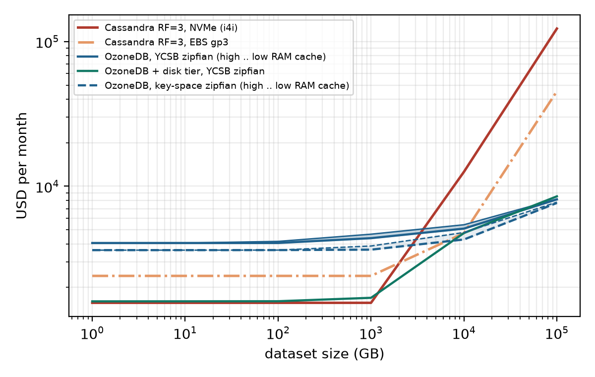

# Results: cost model with measured coefficients (campaign `cost-20260827`)

## Campaign 2: one engine, both systems, 10 GB and 100 GB (`cost2-20260828`)

**Date:** 2026-08-28 to 2026-08-30. **Plan:** `bench/PLAN-cost-2.md`. **Engine:** the
`visibility` tree with the native Corfu client merged (`0c73bf28`), the YCSB core with
the `zipfian_keyspace` distribution (`212f2c7b`), and the SSTable filter fix
(`3b28a2cd`, finding 1). **Clusters:** the campaign ran on two CloudLab experiments. The
first (amd127 as Corfu + MinIO + Cassandra, 8 clients) produced the Cassandra corpus and
a 10 GB OzoneDB corpus, then its lease ended at 04:17 on 2026-08-29 during the first
100 GB cell. The second (amd197 + amd189, 188, 182, 183, 192, 198, 181, 200; identical
hardware, all server state on one 447 GiB SATA SSD at `/tank/ssd`, the tier on each
client's own SSD) reran everything on the fixed build. **Every OzoneDB cell quoted below
is from the second cluster on the fixed build**; the pre-fix cells are kept in
`results-cost2-20260828-prefix.tsv` as the before-and-after control. Cassandra control
cells on the new box reproduce the old box within 2 % (42,376 against 43,237 ops/s on
workload a), so the two Cassandra corpora are interchangeable.

**Datasets:** 10,000,000 and 100,000,000 x 1 KB records. **Client:** one YCSB thread per
client node, 8 nodes, unless a row says 2 or 4. **Trimming:** on, one checkpoint every
30 s. **Metric:** steady-state ops/s, mean of the last 60 s per writer, summed.
**Failures:** 0 failed operations and 8 of 8 writers in every cell of the campaign.
**Corfu client:** native (C++) unless the row says `jni`.

Artifacts, all under `bench/`:

- `results-cost2-20260828.tsv` — the main corpus, one build: OzoneDB at 10 GB and 100 GB
  (RAM and tier cells) and Cassandra at both sizes.
- `results-cost2-20260828-controls.tsv` — scaling, the JNI control and the Cassandra
  control cells, kept out of the medians.
- `results-cost2-20260828-prefix.tsv` — the same 10 GB cells on the build before the
  filter fix.
- `results-cost2-20260828-zipf.tsv` — the key-space zipfian corpus.
- `results-cost2-20260828-projection.tsv`, `-zipf-projection.tsv`,
  `results-cost2-20260828.png` — the projections and the overlay figure.
- `bench/scripts/campaign-cost2/` — every chain that ran, in order.

### Findings

1. **One `std::string` copy per Bloom probe cost 92 % of the client CPU of a read at
   100 GB, and was invisible at 1 GB.** `filterBlockReader::keyMayMatch` copied the
   filter out of its protobuf before probing it. The file-level filter covers every key
   of the SSTable at 10 bits per key, so it is 712 KB for a 570 MB L4 file, and
   `Table::get` probes it once per candidate file. Each get therefore moved about 2.8 MB
   through `mmap` + `memcpy` + `munmap` to read seven bytes. Client CPU per get was
   6.7 ms at 100 GB and read latency 8 ms; `perf` put 80 % of the samples in the AVX2
   `memcpy` loop of libc under `keyMayMatch`. The fix is `std::string const&`
   (`3b28a2cd`). After it, the same cell costs 0.48 ms per op and runs at 6,872 ops/s
   against 1,027. At 10 GB the files are 190 MB and the copy was 0.1 ms to 0.2 ms of the
   0.6 ms, which is why five earlier campaigns did not see it. The hit rates did not
   move: `h` is a cache property.
2. **A read-modify-write update doubles the GET bill and empties the block cache; a blind
   insert does neither.** The YCSB binding's `update()` reads the record, merges one
   field and writes it back, because a record is one opaque blob
   (`OzoneDBClient.java:64`); `insert()` is a blind put. Workload a therefore issues a
   get on every operation, not on half. Swapping the update for an insert (`workloadai`,
   the same 50/50 split and request distribution) at 100 GB cuts GETs per op from 0.710
   to 0.335, raises the SSTable hit rate from 0.023 to 0.368 — the value the read-only
   workload gets — raises throughput by 39 % and cuts client CPU per op by 43 %. The
   mechanism is that an update writes a new version of a *hot* key, so later reads of it
   are served from the data log and only the cold tail reaches the SSTable cache. An
   insert writes a new key, so the read stream keeps its skew. Cassandra moves the other
   way, losing 11 % (42,376 to 37,679 ops/s at 10 GB), because a YCSB update writes one
   column of ten and an insert writes all ten. Workload a is the shape that flatters
   Cassandra most; for a blob store the insert workload is the like-for-like comparison.
3. **The read path wastes no fetches: the filters prune 99.3 % of candidate files.**
   Per-level probe counters (`1662446b`) over a 300 s cell at 100 GB: 6.91 M probes,
   6.87 M pruned by a filter, and 1,124 that fetched a block without finding the key, on
   33,784 reads. On workload c the false-positive rate is 4.5 % of reads. The GET count
   per *operation* is the same on both workloads (0.710 and 0.700); only the reason
   differs.
4. **`h` at a fixed cache-to-data ratio is not scale-free, and the sign depends on the
   stream.** Under YCSB's scrambled zipfian the hot set is a few hundred keys, a fixed
   number of bytes, so a ratio-matched cache is ten times larger in bytes at 100 GB and
   holds more of it: steady `h` on workload c is 0.334 against 0.302 at 0.82 %, 0.252
   against 0.206 at 0.10 %, and 0.153 against 0.135 at 0.013 %. Every 100 GB point sits
   0.02 to 0.05 above its 10 GB twin, inside the 0.06 noise floor the plan set. Under a
   zipfian over the key space the sign is the same but the mechanism is
   `zeta(k) / zeta(N)`: 0.505 against 0.493 at 0.82 % and 0.240 against 0.210 at 0.013 %.
5. **A writer's cache fills at that writer's own miss rate.** At 10 GB one writer misses
   about 475 GETs/s of 4 KiB blocks, 1.9 MB/s, so a 5 GiB cache needs about 45 minutes.
   A 600 s cell closed 25 % full and read `h` = 0.47, the hit rate of a 13 % cache. The
   extractor now writes `cache_fill` and the model skips RAM cells below 0.9 of capacity.
   The tier fills at the miss rate times 64 KiB, about 30 MB/s per writer, so tier cells
   run 1,800 s to 2,700 s.
6. **The disk tier removes the object store from the read path, and once it holds the
   dataset OzoneDB reads faster than Cassandra on the same hardware.** A 20 GiB tier
   behind 80 MiB of RAM serves workload c at 10 GB with 0.019 GETs per op at
   **49,484 ops/s** and 0.10 ms of client CPU, against Cassandra quorum's 43,300 ops/s on
   the same box. Below the dataset size the tier hit rate is a clean function of the
   ratio: 0.018 at 0.026, 0.244 at 0.26, 0.464 at 0.52, 0.97 at 2.1. Fill GETs per op are
   0 in every cell, because in chunk mode the fill is the demand read.
7. **The native client cuts client CPU by 38 % and raises workload-a throughput by 16 %.**
   0.831 ms per op against 1.345 ms on the JNI client, 2,968 against 2,557 ops/s, at the
   same dataset and cache.
8. **Linearizable reads cost nothing measurable.** 3,024 against 2,968 ops/s on workload a
   (+2 %) and 9,780 on workload c. Cassandra's comparable mode (SERIAL reads with LWT
   writes) runs at 32 % of quorum on workload a and 37 % on workload c.
9. **Cassandra at 100 GB is disk-bound, not client-bound.** Quorum workload a falls from
   43,237 ops/s at 10 GB to 23,510 at 100 GB and workload c from 43,534 to 19,772, while
   the server box is only 12 % to 16 % busy. The 100 GB working set does not fit the
   31 GB heap plus page cache. The model's `ops_node_C` is an ops-per-busy-second figure
   and takes the 10 GB value, so the Cassandra line above 10 GB per node is optimistic by
   that amount.
10. **OzoneDB does not scale with the client count on a write-mixed workload.** Per-node
    throughput falls from 556 to 371 ops/s between 2 and 8 client nodes while client CPU
    per op is flat and the server box stays at 10 % busy. Every process tails the whole
    shared log and its reads fence on that tailer, so the fleet's aggregate write rate
    sets each node's read latency.

### Coefficient table

Symbols are those of `bench/PLAN-cost.md`. "Dataset bytes" is records x 1,024.

| Symbol | 10 GB | 100 GB | `cost-20260827` (10 GB) |
|---|--:|--:|--:|
| `sC` Cassandra bytes on disk / dataset bytes, drained load | 1.08 | 1.07 (109.5 GB) | 1.066 |
| `sO` SSTable objects / dataset bytes (checkpoints excluded) | 1.186 (12.26 GB, 65 objects) | 1.190 (121.96 GB, 288 objects) | 1.168 |
| Checkpoint bytes kept in the bucket | 111 MB | 167 MB (11 objects) | 104 MB |
| `L` Corfu log directory, trimming on, at the end of the load | 361 MiB | 51 MB | 171 MiB (8 writers) |
| `L0` slope, trimming off | 1.3 KB per put | — | 1.1 |
| `wa` MinIO bytes in / dataset bytes, during the load | 3.39 | 4.64 (475 GB in) | 3.41 |
| GETs per write during the load | 0.00023 | 0.00029 | 0.032 (before range reads) |
| PUTs per write | 4.4e-5 | 4.8e-5 | 5.1e-5 |
| `k` objects per checkpoint | 6.08 | 6.2 (1,654 / 266) | 6.2 |
| Checkpoint upload, mean | 481 ms | 856 ms | — |
| `j` join: GETs, files restored, replay at a cell start | 6 GETs, 4 files, 550 to 650 ms | 4 files, 51 MB, 612 to 730 ms | 7 GETs, 1.8 s |
| `g` GETs per cache miss, workload c | 0.99 to 1.00 | 0.99 | 1.0 |
| `cpuO` client CPU per op, native, workload a / c | 0.81 to 0.83 ms / 0.34 to 0.44 ms | 1.09 ms / 0.49 to 0.60 ms | 2.0 to 2.3 ms / 1.1 ms (JNI) |
| `cpuO` client CPU per op, JNI control, workload a | 1.35 ms | — | |
| `cpuC` client CPU per op, quorum / serial | 0.060 / 0.080 to 0.089 ms | 0.073 to 0.078 / 0.099 to 0.131 ms | 0.061 / — |
| Server CPU per op, Cassandra quorum / serial | 0.13 / 0.27 to 0.32 ms | 0.19 to 0.22 / 0.39 to 0.49 ms | 0.12 |
| `ops_node_C` one Cassandra box, ops/s at 100 % busy | 271,406 (43,237 at 16 %) | 172,000 (23,510 at 14 %, disk-bound) | 275,000 |
| Load rate, 16 writers on one host | 14,344 puts/s, 0.71 ms CPU per put | 12,312 puts/s, 0.77 ms (2 h 15 min) | 9,627 (8 writers) |

### Cache sweep: `h(c / D)`, workload c, 8 writers, fixed build

| Cache per client | c / D | `h` steady, 10 GB | ops/s, 10 GB | CPU per op | `h` steady, 100 GB | ops/s, 100 GB | CPU per op |
|--:|--:|--:|--:|--:|--:|--:|--:|
| 640 MiB / 6.4 GiB | 6.5 % | 0.418 | 9,045 | 0.34 ms | — | — | — |
| 80 MiB / 800 MiB | 0.82 % | 0.302 | 7,804 | 0.37 ms | 0.334 | 6,872 | 0.49 ms |
| 10 MiB / 100 MiB | 0.10 % | 0.206 | 7,034 | 0.41 ms | 0.252 | 6,330 | 0.54 ms |
| 1.25 MiB / 12.5 MiB | 0.013 % | 0.135 | 6,267 | 0.44 ms | 0.153 | 5,655 | 0.60 ms |

The 1 GB curve of `cost-20260828-4k` at the same ratios: 0.679, 0.341, 0.216, 0.141,
0.032. The `cz` twins (zipfian over the key space) at 100 GB: 0.505 at 0.82 %, 0.418 at
0.10 %, 0.240 at 0.013 %; at 10 GB 0.493 and 0.210 at the two shared ratios.

### Throughput and CPU, 8 writers, fixed build

| System, cell | Workload a ops/s | CPU per op | Workload c ops/s | CPU per op |
|---|--:|--:|--:|--:|
| OzoneDB native, 5 GiB, 10 GB | 2,968 | 0.83 ms | 9,045 (640 MiB) | 0.34 ms |
| OzoneDB native, 100 MiB / 80 MiB, 10 GB | 2,997 | 0.81 ms | 7,804 | 0.37 ms |
| OzoneDB native, linearizable, 5 GiB, 10 GB | 3,024 | 0.77 ms | 9,780 | 0.31 ms |
| OzoneDB JNI, 5 GiB, 10 GB | 2,557 | 1.35 ms | — | — |
| OzoneDB native, 100 MiB, 100 GB | 2,756 | 1.09 ms | 6,330 | 0.54 ms |
| OzoneDB native, 20 GiB tier, 10 GB | 4,211 | 0.73 ms | 49,484 | 0.10 ms |
| Cassandra quorum, 10 GB | 42,376 | 0.062 ms | 43,300 | 0.060 ms |
| Cassandra serial, 10 GB | 13,636 | 0.089 ms | 16,076 | 0.080 ms |
| Cassandra quorum, 100 GB | 23,510 | 0.073 ms | 19,772 | 0.078 ms |
| Cassandra serial, 100 GB | 8,277 | 0.131 ms | 11,612 | 0.099 ms |

### Insert against read-modify-write update (finding 2)

Workload `ai` is workload a with a blind insert in place of the update. Same box, same
duration, same cache.

| Cell | ops/s | GETs per op | `h` | CPU per op |
|---|--:|--:|--:|--:|
| OzoneDB, 100 GB, 100 MiB, workload a | 2,619 | 0.710 | 0.023 | 1.47 ms |
| OzoneDB, 100 GB, 100 MiB, workload `ai` | 3,628 | 0.335 | 0.368 | 0.84 ms |
| OzoneDB, 100 GB, 100 MiB, workload c | 6,270 | 0.700 | 0.337 | 0.61 ms |
| Cassandra quorum, 10 GB, workload a | 42,376 | — | — | 0.062 ms |
| Cassandra quorum, 10 GB, workload `ai` | 37,679 | — | — | 0.066 ms |
| Cassandra quorum, 100 GB, workload a | 34,480 | — | — | 0.065 ms |
| Cassandra quorum, 100 GB, workload `ai` | 34,321 | — | — | 0.066 ms |

Cassandra's own insert-against-update difference is a throughput effect, not a
structural one: 11 % at 10 GB, where the box runs at 43,000 ops/s and the extra nine
columns of an insert cost something, and 0.5 % at 100 GB, where the box is disk-bound at
34,000 ops/s and the write path is not the limit. OzoneDB's 39 % gain is structural: the
update path issues a second get, the insert path does not.

Two caveats. The run phase passes no `insertstart`, so every writer generates the same
new key sequence; each inserted key is written once per writer, the write path is
unaffected, and the dataset grows by one eighth of the inserts. And the 100 GB Cassandra
pair ran on a dataset that had just been written, so the server's page cache held much of
it: those two cells read 34,000 ops/s where the first cluster's restored 100 GB cells
read 23,510. The pair is internally consistent, which is what the comparison needs; the
model keeps the first cluster's 100 GB numbers.

### Server scaling, workload a, 5 GiB cache, fixed build

| Client nodes | OzoneDB ops/s (per node) | CPU per op | Cassandra quorum ops/s (per node) |
|--:|--:|--:|--:|
| 2 | 1,113 (556) | 0.70 ms | 10,358 (5,179) |
| 4 | 1,765 (441) | 0.80 ms | 22,363 (5,591) |
| 8 | 2,968 (371) | 0.83 ms | 43,237 (5,405) |

### Disk-cache tier, chunk 64 KiB + frequency admission, fixed build

| Tier per client | tier / D | Workload | ops/s | `disk_h` | CPU per op | GETs per op |
|--:|--:|---|--:|--:|--:|--:|
| none, 80 MiB RAM, 10 GB | — | c | 7,804 | — | 0.37 ms | 0.667 |
| 2.5 GiB, 10 GB | 0.26 | c | 9,558 | 0.244 | 0.36 ms | 0.507 |
| 5 GiB, 10 GB | 0.52 | c | 12,671 | 0.464 | 0.28 ms | 0.360 |
| 20 GiB, 10 GB | 2.1 | c | 49,484 | 0.97 | 0.10 ms | 0.019 |
| 5 GiB, 10 GB | 0.52 | a | 3,377 | 0.307 | 0.80 ms | 0.470 |
| 20 GiB, 10 GB | 2.1 | a | 4,211 | 0.616 | 0.73 ms | 0.298 |
| none, 800 MiB RAM, 100 GB | — | c | 6,872 | — | 0.49 ms | 0.605 |
| 2.5 GiB, 100 GB | 0.026 | c | 6,662 | 0.018 | 0.68 ms | 0.588 |
| 25 GiB, 100 GB | 0.26 | c | 8,031 | 0.213 | 0.49 ms | 0.470 |
| 50 GiB, 100 GB | 0.52 | c | 10,088 | 0.378 | 0.44 ms | 0.359 |
| 50 GiB, 100 GB | 0.52 | a | 2,800 | 0.216 | 1.25 ms | 0.559 |
| 25 GiB, 100 GB, `cz` | 0.26 | cz | 10,024 | 0.340 | 0.46 ms | 0.310 |

`disk_h` at a matched ratio reproduces across the decade within 0.03 (0.244 against
0.213 at 0.26, 0.464 against 0.378 at 0.52), and the key-space zipfian lifts it by 0.13
at the same ratio. `disk_punch_failed` is 0 in every cell.

### Projection: 10,000 ops/s, 50 % reads, RF=3 (USD per month)

From `results-cost2-20260828-projection.tsv`: the fixed-build cells, `space.json` from
the 100 GB load (`sO` 1.190, `wa` 4.64, `L` 0.05 GiB, `sC` 1.069, `L0` 1.3 KB per put),
and the tier coefficients from the four measured tier ratios. Where a ratio has cells at
both sizes the model keeps the longer one, which selects the 100 GB cell. The key-space
zipfian column comes from `-zipf-projection.tsv`, whose `h` is the `cz` curve and whose
other coefficients are shared.

**The Cassandra lines are priced against `cassandra-serial`** (SERIAL reads + LWT
writes, the linearizable mode), through `plot_cost_model.py --cassandra-mode serial`,
which is now the default. That is the like-for-like point for OzoneDB, whose reads are
linearizable at no measured cost (finding 8). The serial cells give `cpuC` 0.11 ms per
op (the median of 0.089 ms at 10 GB and 0.131 ms at 100 GB) and `ops_node_C` 117,085
ops per busy server-second, against 0.06 ms and 271,406 for quorum. The dollar lines
are the same as a quorum projection to the dollar, because at 10,000 ops/s neither
coefficient reaches a threshold: one `c6i.large` client serves up to 12,700 ops/s at
0.11 ms, and the server count is storage-bound above the three-node floor at every size
(serial would need a fourth node for CPU only above 246,000 ops/s). The mode changes
the throughput comparison, not the cost one, and the projection table carries it as
the `cass_mode` column. `--cassandra-mode quorum` reproduces the earlier run.

**Paper figure.** `bench/fig_cost.{pdf,png}` (double column: (a) the projection, (b) the
10 TB bill) and `bench/fig_cost_col.{pdf,png}` ((a) alone, single column) come from
`bench/scripts/plot/paper_cost_figure.py`, which evaluates the same `Coefficients` and
`Model` on a 48-per-decade grid from 10 GB, **at 10 % reads and 90 % blind writes**
(`--read-fraction 0.10`; the figure's legend title says so):

```bash
uv run --with matplotlib python3 bench/scripts/plot/paper_cost_figure.py \
  bench/results-cost2-20260828.tsv bench/scripts/plot/prices.json \
  --space bench/scripts/plot/space.json --tier-variant ch64k-adm \
  --cassandra-mode serial --read-fraction 0.10 --out bench/fig_cost
```

Three series — OzoneKV (the paper's name for the system) with the 16 GB cache as one
line (the 4 GB line is at most $350 above it and is left to the text), Cassandra EBS,
Cassandra NVMe as the gray context line — filled markers at the two measured sizes and
none beyond, and one "cheaper from" marker at the smallest size from which the OzoneKV
line *stays* below the cheaper Cassandra layout: at 10 % reads **1.3 TB**, the NVMe
layout's fourth-node step. Numbers at this mix: OzoneKV $1,645 at 100 GB and $1,732 at
1 TB against Cassandra EBS $2,402 and NVMe $1,565; at 10 TB OzoneKV $2,073 (GETs $759,
the log tier $614, clients $420, S3 storage $274) against EBS $4,742; at 100 TB $4,646
against $45,302. Panel (b) shows the 10 TB bill of the two lines the text argues from.

The SSD tier is **not drawn** (`--tier` puts it back, with its bar and its own marker).
At this mix the tier line crosses *above* the RAM line near 2 TB and reads $2,388 at
10 TB: with 1,000 reads/s there is little left for a tier to serve, and its $480 of
gp3 is not recovered. Below 1 TB it matches NVMe Cassandra ($1,539 against $1,565).
The 2 TB per writer is the price parameter `disk_gb_per_client` (it mirrors the i4i
node's 1.875 TB); the measured cells used budgets of 2.5 GiB to 50 GiB on a 447 GB
SSD, and the model reads the measured hit-rate-against-ratio curve at the projected
ratio. With a 447 GB tier the line helps only below 1 TB.

Caveats the caption must carry: the campaign measured no cell below 50 % reads, so the
client CPU per op is workload a's (0.83 ms; the loads measured 0.71 to 0.77 ms per put,
so the client count holds) and reads were not measured beside a 9,000 puts/s fleet
write rate (finding 10; the loads ran 12,000 to 14,000 puts/s from one host); at
10,000 ops/s the 90 % insert stream adds 24 TB a month, so the x-axis is a point in
time unless the writes are overwrites. The GET line is linear in the read fraction
($757 a month per 10 points at 10 TB): at 25 % reads the marker moves to 5.4 TB (the
EBS fourth-node step), at 50 % reads to a 10 TB to 13 TB band (the tier line is $4,753
against $4,742 at exactly 10 TB, and `plot_cost_model.py`'s first-dip crossovers of
12.1 TB and 14.7 TB are grid artefacts), and at 100 % reads (a read-modify-write
update) to 26 TB.

| D | Cassandra NVMe | Cassandra EBS | OzoneDB, 16 GB cache | OzoneDB, 4 GB | OzoneDB + 2 TB tier per client | OzoneDB, no trimming | `h` at 16 GB | zipfian, 16 GB |
|--:|--:|--:|--:|--:|--:|--:|--:|--:|
| 100 GB | 1,565 | 2,402 | 4,056 | 4,160 | **1,605** | 4,085 | 0.418 | 3,622 |
| 1 TB | 1,565 | 2,402 | 4,378 | 4,665 | **1,695** | 4,688 | 0.361 | 3,646 |
| 10 TB | 12,587 | 4,742 | 5,097 | 5,421 | 4,753 | 8,215 | 0.270 | 4,286 |
| 100 TB | 122,807 | 45,302 | **8,112** | 8,168 | 8,516 | 39,310 | 0.163 | 7,665 |

At 10 TB the $5,097 is S3 GET requests $3,785 (74 %), the log tier $614, clients $420,
S3 storage $274 and PUTs $5. The crossover of the 4 GB line with the cheaper Cassandra
layout is 14.7 TB, and 12.1 TB with the tier; it sits on the EBS layout's node knee, not
on OzoneDB's level. Two regimes matter more than the crossover:

- **A tier that holds the dataset** (up to about 1.4 TB with 2 TB of gp3 per client)
  makes OzoneDB the cheapest option measured: $1,605 to $1,695 against Cassandra EBS
  $2,402 and NVMe $1,565, because `disk_h` is 0.97 and the object store leaves the read
  path.
- **Above 10 TB** the node count decides. Cassandra needs 25 NVMe nodes at 10 TB and 58
  EBS nodes at 100 TB; OzoneDB's cost grows only with storage and requests, so it is 5.6x
  cheaper at 100 TB.

Between those, at 100 GB to 2 TB with no tier, Cassandra is 1.7x to 1.9x cheaper. The
projection prices reads at 50 % of operations, which is right for blind writes; a
read-modify-write update workload issues a get on every operation and doubles the GET
line (finding 2).



### Method notes

- The server state lives on `/tank/ssd` (`sdb`, ext4, label `ozssd`). `/tank/minio` is a
  bind mount into it: MinIO `lstat`s its drive path and refuses a symlink. `/mnt/corfu`
  and `/tank/cassandra` are symlinks. `server_sampler.sh` runs `du -skD` for that reason.
- `cassandra_ctl.sh start` waits for the JMX port 7199 to leave `TIME_WAIT` after
  `nodetool drain`.
- The load's writer files are not pulled by the orchestrator. Each chain copies them from
  the load host.
- The 52 % cache point at 10 GB needs a cell of about 4,800 s (finding 5) and was not
  run. The 640 MiB cell and every smaller one closed full.
- The 100 GB Cassandra cells of the first cluster are the ones quoted; the second cluster
  reloaded 100 GB only for the insert pair, without a `data.load` snapshot, because
  `/tank/ssd` cannot hold the dataset and its copy at that size.
- One trial per cell. Differences under 5 % are not resolved. The three ratio twins at
  both sizes are the only repeated measurement, and they agree within 0.05 of `h`.


**Date:** 2026-08-27. **Plan:** `bench/PLAN-cost.md`. **Cluster:** CloudLab amd127
(Corfu + MinIO + Cassandra, 32 cores, 125 GB RAM, one 63 GB root disk) + 8 clients
(amd160, 126, 138, 135, 166, 146, 159, 133; 32 cores each). **Datasets:** 1,000,000 and
10,000,000 x 1 KB records. **Replication:** factor 1 on both systems on the cluster, RF=3
in the projection. **Trimming:** on (`--log-trim`, one checkpoint every 30 s) unless a cell
says `notrim`. **Metric:** steady-state ops/s, mean of the last 60 s per writer, summed.
**Failures:** 0 failed operations in every cell. **Cells:** 37 rows, all `rc=0`.
**Correction (2026-08-27):** every OzoneDB workload-a cell lost 1 to 4 of its 8 writers
to a native crash that the runner did not report; the workload-a sums are survivor sums.
Found in the 4 KiB re-run, fixed in `96b9265d`. See "A crash in every workload-a cell".

Artifacts, all under `bench/`:

- `results-cost-20260827.tsv` — one row per cell, 64 columns (`extract_cost_coefficients.py`).
- `results-cost-20260827-loads-1gb.tsv` — the two 1 GB load rows with their server sample
  (see "Method notes": the 10 GB load overwrote those sample files later).
- `results-cost-20260827-projection.tsv` — the projection, totals and per-line breakdown.
- `results-cost-20260827.{png,pdf}` — the figure. `scripts/plot/space.json` — the space
  coefficients. `scripts/plot/prices.json` — list prices, read 2026-08-26.

## Findings

1. **The block cache has no zipfian locality, so `h` tracks the capacity fraction.**
   At a cache of 52 % of the SSTable bytes the steady-state hit rate is 0.645, at 6.6 %
   it is 0.23, at 0.8 % it is 0.10, and at 0.1 % and below it is 0.01 or less. The cause is
   the 64 KB SSTable block (`src/db/sstable/table_builder.cpp:16`) under YCSB's hashed
   keys: the hot keys are spread over every block of the table. The plan's assumption
   `h >= 0.99` does not hold for this engine. The 10 GB cells confirm the shape: at the
   same cache-to-data ratio, `h` differs by at most 0.06 from the 1 GB point.
2. **The S3 GET line dominates OzoneDB at every scale.** At 10,000 ops/s with 50 % reads
   and a 16 GB client cache, GETs cost $1,954 per month at 1 GB (h = 0.645) and $5,045 at
   10 TB (h = 0.03). Storage, compaction PUTs and checkpoint PUTs together stay under
   $300 up to 10 TB. A row cache, or blocks of 4 KB, is the engine change that moves the
   curve. Without one, the "cheap object store" argument rests on GET pricing, not on
   storage pricing. The 4 KiB re-run below (`cost-20260828-4k`) measures that change:
   `h` 1.05x to 19x higher, but compaction GETs 13.6x higher until compaction reads
   ranges instead of blocks.
3. **OzoneDB clients need 35x the CPU per operation of Cassandra clients.** Workload a:
   2.16 ms per op (median, 8 writers, survivor writers of the crash below) against
   0.061 ms; 1.37 ms on the 4 KiB build with the crash fix (600 s, 8/8 writers), 1.16 ms
   with compaction range reads (`2dc2ed24`, 600 s cells only). Every OzoneDB process tails the
   whole shared log and runs compaction, so the per-op client CPU grows with the
   aggregate write rate: 0.85 ms at 2 writers, 1.09 ms at 4, 1.58 ms at 8. At 10,000 ops/s
   that is 8 `m6i.xlarge` clients ($1,120) against one `c6i.large` ($62).
4. **Crossover at 17.8 TB.** With a 4 GB cache per client, OzoneDB with trimming becomes
   cheaper than the cheaper Cassandra layout (RF=3 on EBS gp3, 8 TB per node) at 17.8 TB.
   Against Cassandra on NVMe (`i4i.2xlarge`) the crossover is 5.6 TB. Without trimming
   ("today") the crossovers move to 8.3 TB (NVMe) and 46 TB (EBS). Below 1 TB,
   Cassandra costs $1,565 per month on three nodes, and OzoneDB costs $3,700 to $6,600.
   The pre-measurement estimate (break-even at 1 to 4 TB, 4 to 6x cheaper at 10 TB)
   assumed `h >= 0.99` and a client CPU near Cassandra's. Neither held.
5. **The log tier is flat in D and trimming works as designed.** The trimmed Corfu log is
   187 MiB at 1 GB and 171 MiB at 10 GB. A checkpoint is 5 to 6 objects (22 objects over 4
   checkpoints at 1 GB, 222 over 36 at 10 GB), so checkpoint PUTs cost $2 per month at
   30 s intervals. A joining process restores 3 to 5 files (28 to 70 MB) with 5 to 7 GETs
   and replays 36k to 51k entries in 1.4 to 1.9 s. Without trimming, the log tier reaches
   $3,254 at 10 TB (11 TB of log) and $27,014 at 100 TB, which is the dashed "today" line.
6. **Consistency costs little on the OzoneDB side and a lot on the Cassandra side.**
   Linearizable OzoneDB reads run at the default rate on workload c (11,008 against
   10,830 ops/s) and 7 % lower on workload a. Cassandra serial (SERIAL reads + LWT writes)
   runs at 31 % (a) and 36 % (c) of quorum, with 2.7x the server CPU per op.

## Coefficient table

Symbols are those of `bench/PLAN-cost.md`. "Dataset bytes" is records x 1,024.

| Symbol | 1 GB | 10 GB | Source |
|---|--:|--:|---|
| `sC` Cassandra live bytes / dataset bytes, after `nodetool compact` | 1.066 (1,091,949,066 B) | 1.066 (10,918,624,402 B) | phase 1, phase 5 |
| `sC` peak before compact | 1.066 (1 SSTable after the drain) | 1.066 (7 SSTables, 10,920,018,751 B) | phase 1, phase 5 |
| `sO` SSTable objects / dataset bytes (checkpoints excluded) | 1.172 (1,145 MiB, 10 objects) | 1.168 (11.96 GB, 64 objects incl. checkpoints) | phase 1, phase 5 |
| Checkpoint bytes kept in the bucket | 44 MiB (2 kept) | 104 MB | phase 1, phase 5 |
| `L` Corfu log directory, trimming on | 187 MiB | 171 MiB | phase 1, phase 5 |
| `L0` slope, trimming off | 1.1 KB per put | (not repeated) | `PLAN-trimming.md` |
| `wa` MinIO bytes in / dataset bytes, during the load | 2.34 | 3.41 | phase 1, phase 5 |
| GETs per write (compaction reads during the load) | 0.015 | 0.032 | phase 1, phase 5 |
| PUTs per write (compaction + checkpoint objects) | 4.7e-5 | 5.1e-5 | phase 1, phase 5 |
| `k` objects per checkpoint | 5.5 (22 / 4) | 6.2 (222 / 36) | phase 1, phase 5 |
| Checkpoint live bytes, upload time | 35 MB, 287 ms | 55 MB, 454 ms | phase 1, phase 5 |
| `j` GETs per join, replay | 5 GETs, 35,641 entries in 1.4 s, 28 MB restored | 7 GETs, 50,758 entries in 1.8 s, 70 MB restored | phases 2, 5 |
| `g` GETs per cache miss, workload c | 1.00 (600 s), 0.95 (120 s) | 1.0 | phase 2 |
| `h` steady state, workload c, see the next table | 0.645 .. 0.002 | 0.069 (0.1 %), 0.0 (0.013 %) | phases 2, 5 |
| `cpuO` client CPU per op, default / linearizable | a: 1.58 / 1.39 ms; c: 0.34 / 0.39 ms | a: 2.0-2.3 ms; c: 1.1 ms | phases 2, 5 |
| `cpuC` client CPU per op, quorum / serial | a: 0.062 / 0.091 ms; c: 0.059 / 0.076 ms | a: 0.061 ms; c: 0.060 ms | phases 3, 5 |
| Server CPU per op, OzoneDB (Corfu + MinIO) | a: 1.2 ms; c: 0.56 ms (512 MB) .. 1.3 ms (128 KB) | a: 1.3-1.5 ms; c: 1.0-1.1 ms | phases 2, 5 |
| Server CPU per op, Cassandra quorum / serial | 0.12 / 0.33 ms (a), 0.12 / 0.26 ms (c) | 0.12 ms | phases 3, 5 |
| `ops_node_C` one Cassandra box, ops/s at 100 % busy | 275,000 (45,389 ops/s at 16.6 % busy) | | phase 4 |
| Load rate, 8 writers | OzoneDB 9,417 puts/s (0.86 ms client CPU per put); Cassandra 36,707 (0.12 ms) | OzoneDB 9,627 (0.70 ms); Cassandra 42,826 (0.063 ms) | phases 1, 5 |

`g` reads 0.95 in the 120 s cells because reads of keys that still sit in the log tail
miss the record cache without an S3 GET. The product `g x (1 - h)` equals the measured
GETs per op, which is what the model uses.

## Cache sweep: `h(c / D)` at 1 GB, workload c, 8 writers, 600 s cells

| Cache per client | c / D | `h` (steady, last 60 s) | GETs per op | ops/s | Client CPU per op | Server CPU per op |
|--:|--:|--:|--:|--:|--:|--:|
| 512 MB | 52.4 % | 0.645 | 0.355 | 10,575 | 0.34 ms | 0.56 ms |
| 64 MB | 6.55 % | 0.232 | 0.762 | 6,126 | 0.55 ms | 1.03 ms |
| 8 MB | 0.82 % | 0.101 | 0.892 | 5,286 | 0.61 ms | 1.20 ms |
| 1 MB | 0.10 % | 0.012 | 0.980 | 5,059 | 0.62 ms | 1.31 ms |
| 128 KB | 0.013 % | 0.002 | 0.991 | 4,982 | 0.63 ms | 1.35 ms |

The 120 s cells of the same sizes give 0.597, 0.198, 0.062, 0.0, 0.0: the last minute of
a 120 s run is still filling the larger caches. The 10 GB cells at 0.10 % and 0.013 %
give 0.069 and 0.0.

## Throughput and CPU, 8 writers, 120 s cells

| Cell | Workload | ops/s | GETs per op | PUTs per op | Client CPU per op | Server CPU per op | Server busy |
|---|---|--:|--:|--:|--:|--:|--:|
| OzoneDB 512 MB | a | 2,960 | 0.38 | 4.7e-5 | 1.58 ms | 1.21 ms | 11 % |
| OzoneDB 512 MB, trimming off | a | 3,026 | 0.36 | 3.3e-5 | 1.76 ms | 1.35 ms | 11 % |
| OzoneDB 512 MB, linearizable | a | 2,939 | 0.40 | 4.1e-5 | 1.39 ms | 1.11 ms | 9 % |
| OzoneDB 64 MB .. 128 KB | a | 2,539 .. 2,579 | 0.54 .. 0.65 | 7.3e-5 .. 9.1e-5 | 2.4 .. 3.0 ms | 2.1 .. 2.6 ms | 11 % |
| OzoneDB 512 MB | c | 10,830 | 0.38 | 4e-6 | 0.39 ms | 0.56 ms | 17 % |
| OzoneDB 512 MB, trimming off | c | 10,902 | 0.38 | 4e-6 | 0.39 ms | 0.55 ms | 17 % |
| OzoneDB 512 MB, linearizable | c | 11,008 | 0.38 | 4e-6 | 0.39 ms | 0.55 ms | 17 % |
| Cassandra quorum | a | 43,183 | | | 0.062 ms | 0.12 ms | 17 % |
| Cassandra quorum | c | 45,389 | | | 0.059 ms | 0.12 ms | 17 % |
| Cassandra serial | a | 13,289 | | | 0.091 ms | 0.33 ms | 14 % |
| Cassandra serial | c | 16,540 | | | 0.076 ms | 0.26 ms | 13 % |
| OzoneDB 10 MB, 10 GB | a | 2,301 | 0.70 | 6.3e-5 | 2.30 ms | 1.50 ms | 9 % |
| OzoneDB 10 MB, 10 GB | c | 4,619 | 0.89 | 1.2e-5 | 1.10 ms | 0.99 ms | 13 % |
| OzoneDB 1.25 MB, 10 GB | a | 2,299 | 0.70 | 5.5e-5 | 2.03 ms | 1.32 ms | 9 % |
| OzoneDB 1.25 MB, 10 GB | c | 4,331 | 0.98 | 1.2e-5 | 1.14 ms | 1.10 ms | 14 % |
| Cassandra quorum, 10 GB | a | 43,669 | | | 0.061 ms | 0.12 ms | 16 % |
| Cassandra quorum, 10 GB | c | 44,213 | | | 0.060 ms | 0.11 ms | 16 % |

The trimmer adds 1.4e-5 PUTs per op on workload a (4.7e-5 against 3.3e-5) and changes
throughput by 2 % or less. **OzoneDB workload-a rows are sums over the writers that
survived the crash described in the 4 KiB section:** 7/8 at 512 MB, 5/8 at 64 MB, 8 MB
and 1 MB, 4/8 at 128 KB, 6/8 with trimming off, 8/8 linearizable, 7/8 and 8/8 at 10 GB.
Workload c and Cassandra rows are complete (8/8).

## Server scaling, workload a, 512 MB cache

| Clients | OzoneDB ops/s | per writer | OzoneDB client CPU per op | OzoneDB server busy | Cassandra quorum ops/s | Cassandra server busy |
|--:|--:|--:|--:|--:|--:|--:|
| 2 | 1,370 | 685 | 0.85 ms | 3.4 % | 10,480 | 4.4 % |
| 4 | 2,003 | 501 | 1.09 ms | 5.4 % | 22,097 | 8.2 % |
| 8 | 2,960 | 370 | 1.58 ms | 11.1 % | 43,183 | 17.0 % |

Cassandra scales linearly and is client-bound. OzoneDB scales sublinearly while its server
stays below 12 % busy: the limit is the client path, not the server.

## Projection: 10,000 ops/s, 50 % reads, RF=3, list prices of 2026-08-26 (USD per month)

| Cost line | 1 GB | 1 TB | 10 TB |
|---|--:|--:|--:|
| Cassandra nodes, NVMe `i4i.2xlarge` x N | 1,503 (N=3) | 1,503 (N=3) | 12,525 (N=25) |
| Cassandra nodes, EBS `m6i.xlarge` + 8 TB gp3 x N | 2,340 (N=3) | 2,340 (N=3) | 4,680 (N=6) |
| Cassandra clients (`c6i.large`) | 62 (1) | 62 (1) | 62 (1) |
| **Cassandra total, NVMe / EBS** | **1,565 / 2,402** | **1,565 / 2,402** | **12,587 / 4,742** |
| OzoneDB log tier (sequencer `c6i.large` + 3 log units `r6i.xlarge`, `L`) | 614 | 614 | 614 |
| S3 storage (`sO x D` + checkpoints) | 0 | 27 | 270 |
| S3 GETs at `h(16 GB / D)` | 1,954 (h 0.645) | 4,481 (h 0.143) | 5,045 (h 0.031) |
| S3 GETs at `h(4 GB / D)` | 1,954 (h 0.645) | 4,848 (h 0.071) | 5,165 (h 0.008) |
| S3 PUTs, compaction | 2 | 2 | 2 |
| S3 PUTs, checkpoints at `T_trim` = 30 s | 2 | 2 | 2 |
| OzoneDB clients (`m6i.xlarge`) | 1,120 (8) | 1,120 (8) | 1,120 (8) |
| **OzoneDB total, 16 GB cache** | **3,693** | **6,247** | **7,053** |
| **OzoneDB total, 4 GB cache** | **3,693** | **6,613** | **7,173** |
| OzoneDB "today" (no trimming: log tier holds `L0` x total writes) | 3,691 | 6,509 | 9,691 |

The model holds `h` flat beyond the largest measured ratio (52 %), so the 16 GB and
4 GB lines coincide below 30 GB. That is conservative: a cache larger than the table
would hit near 1.0. The `ozone_today` line assumes the same 10,000 ops/s ran for one
month with no trimming. `results-cost-20260827-projection.tsv` holds every line for
1 GB to 100 TB.

## Figure

`results-cost-20260827.png`: log-log, dataset size 1 GB to 100 TB against USD per month.
Cassandra RF=3 on NVMe and on EBS, OzoneDB with trimming as a band (16 GB to 4 GB cache
per client), OzoneDB without trimming dashed, measured cells at 1 GB and 10 GB, the
crossover at 17.8 TB. Stated assumptions:

1. List prices, us-east-1, on-demand, 730 h per month, read 2026-08-26.
2. The Cassandra node count is the larger of the 3-node floor, the storage bound at 70 %
   fill, and the ops bound from `ops_node_C`. Storage binds above 1 TB.
3. The hot set is scale-free: `h` depends on `c / D` only. Checked at 1 GB and 10 GB
   (difference at most 0.06 at equal ratio).
4. The log tier is flat in D with trimming. Checked at 1 GB (187 MiB) and 10 GB (171 MiB).

## Re-run with 4 KiB blocks (campaign `cost-20260828-4k`, engine commit `dd0f195e`)

**Date:** 2026-08-27. **Change:** `BLOCK_SIZE` 65536 to 4096 in
`src/db/sstable/table_builder.cpp:16`, the SlateDB and LevelDB default. Everything else is
the same as `cost-20260827`: same cluster, same 8 clients, `build.sh` on every client, a
fresh 1 GB load with trimming, the 600 s workload-c sweep at the five cache sizes, then
a/c cells at 512 MB and 8 MB (120 s and 600 s). The 600 s workload-a cells ran on the
build with the crash fix `96b9265d` (see "A crash in every workload-a cell"). The
Cassandra rows are those of `cost-20260827`. All cells `rc=0`; the two 600 s workload-a
cells count 1 and 6 failed reads in 1.6 M operations (a key in a file removed under the
reader, the documented transient miss of the non-linearizable path).

Artifacts, under `bench/`: `results-cost-20260828-4k.tsv` (15 rows),
`results-cost-20260828-4k-projection.tsv` (compaction GETs as measured),
`results-cost-20260828-4k-projection-rangeread.tsv` (compaction GETs set to zero, see
below), `results-cost-20260828-4k.png`.

### Cache sweep, workload c, 8 writers, 600 s cells: 64 KiB against 4 KiB

| Cache per client | c / D | `h` 64 KiB | `h` 4 KiB | Gain | Simulated gain | ops/s 64 KiB | ops/s 4 KiB | Client CPU per op 64 / 4 | Server CPU per op 64 / 4 |
|--:|--:|--:|--:|--:|--:|--:|--:|--:|--:|
| 512 MB | 52.4 % | 0.645 | 0.675 | 1.05x | 1.12x | 10,575 | 14,350 | 0.34 / 0.25 ms | 0.56 / 0.42 ms |
| 64 MB | 6.55 % | 0.232 | 0.341 | 1.47x | 1.47x | 6,126 | 8,086 | 0.55 / 0.37 ms | 1.03 / 0.74 ms |
| 8 MB | 0.82 % | 0.101 | 0.215 | 2.13x | 1.88x | 5,286 | 7,057 | 0.61 / 0.42 ms | 1.20 / 0.87 ms |
| 1 MB | 0.10 % | 0.012 | 0.141 | 11.3x | 3.3x | 5,059 | 6,419 | 0.62 / 0.46 ms | 1.31 / 0.96 ms |
| 128 KB | 0.013 % | 0.002 | 0.032 | 19x | 9x | 4,982 | 5,858 | 0.63 / 0.50 ms | 1.35 / 1.06 ms |

"Simulated gain" is the ratio of LRU hit rates for 4-record and 64-record blocks in a
zipfian (0.99) simulation over 1M hashed keys, at the same cache ratio. The middle of the
curve matches the simulation. The small caches gain more than simulated because the
measured 64 KiB curve was below the simulation there (a 1 MB cache holds 16 blocks of
64 KiB and 256 blocks of 4 KiB). Read throughput rose 18 to 36 % at every size, and the
client CPU per read fell 21 to 27 %: a miss now parses 4 records instead of 64. Peak RSS
per client rose 10 %. `g` stays 0.993 GETs per miss.

### Load, compaction and the 4 KiB penalty

| | 64 KiB | 4 KiB |
|---|--:|--:|
| Load, 8 writers, 1M x 1 KB | 9,417 puts/s, 120 s | 8,054 puts/s, 147 s |
| GETs per put (compaction input reads) | 0.015 | **0.205** |
| PUTs per put | 4.7e-5 | 4.4e-5 |
| Client CPU per put | 0.86 ms | 0.91 ms |
| Server CPU per put | 0.32 ms | 0.56 ms |
| SSTables after the load (bucket) | 203 + 942 MiB | 204 + 953 MiB |
| Trimmed log, checkpoints, objects | 187 MiB, 4, 22 | 188 MiB, 4, 20 |

Compaction reads every input file through `Table::getAll`
(`src/db/sstable/table_reader.cpp`), which calls `readBlock` once per block, and
`readBlock` (`src/db/sstable/block_handler.cpp:88`) issues one `storage->read` per call.
Sixteen times more blocks means 13.6x more GETs per put. The index grew 16x in entries
(about 1 % of the bucket) and the table-open cost did not change (5 GETs per join).

### Workload a and 120 s cells

| Cell | Workload | Duration | ops/s 64 KiB | ops/s 4 KiB | GETs per op 64 / 4 | Client CPU per op 64 / 4 | Server CPU per op 64 / 4 |
|---|---|--:|--:|--:|--:|--:|--:|
| 512 MB | a | 120 s | 2,960 | 2,605 | 0.38 / 0.76 | 1.58 / 1.53 ms | 1.21 / 1.36 ms |
| 8 MB | a | 120 s | 2,543 | 2,528 | 0.64 / 0.80 | 2.47 / 1.54 ms | 2.14 / 1.40 ms |
| 512 MB | c | 120 s | 10,830 | 10,218 | 0.38 / 0.50 | 0.39 / 0.41 ms | 0.56 / 0.62 ms |
| 8 MB | c | 120 s | 5,398 | 7,003 | 0.89 / 0.76 | 0.71 / 0.52 ms | 1.17 / 0.85 ms |
| 512 MB | a | 600 s, fix `96b9265d` | none | 2,708 (8/8) | - / 0.65 | - / 1.17 ms | - / 1.26 ms |
| 8 MB | a | 600 s, fix `96b9265d` | none | 2,566 (8/8) | - / 0.79 | - / 1.21 ms | - / 1.37 ms |

Two caveats apply to 120 s cells with 4 KiB blocks. First, a 4 KiB miss brings 4 records
into the cache, a 64 KiB miss brings 64, so a 512 MB cache fills 16x slower: the 512 MB
120 s cells are still warm-up (`h` 0.475 against 0.675 at 600 s). Second, under workload a
the last-60 s GET rate includes the compaction reads, so "GETs per op" on workload a is
reads plus compaction, not `g x (1 - h)`. The client CPU per op on workload a, the number
the projection uses, is 1.37 ms, the median of the four 4 KiB workload-a cells (2.16 ms in
the 64 KiB cells, whose survivors ran with fewer peers). Per writer, the 600 s cells give
339 and 321 ops/s at 8/8 writers; the 64 KiB 120 s survivors averaged 329 (512 MB, 7/8)
and 291 (8 MB, 5/8) over their runs, so the block size does not change workload-a
throughput by more than the crash noise. Peak RSS per client reached 3.9 GB at 512 MB
(2.8 GB in the 64 KiB 120 s cell): retired Tables of removed files are kept 30 s.

### Projection with the 4 KiB curve: 10,000 ops/s, 50 % reads, RF=3 (USD per month)

| | 1 GB | 1 TB | 10 TB | Crossover vs Cassandra on EBS |
|---|--:|--:|--:|--:|
| Cassandra, NVMe / EBS | 1,565 / 2,402 | 1,565 / 2,402 | 12,587 / 4,742 | |
| OzoneDB 64 KiB, 16 GB cache (`cost-20260827`) | 3,693 | 6,247 | 7,053 | 17.8 TB |
| OzoneDB 4 KiB, compaction GETs as measured (0.205 per put) | 4,092 | 6,308 | 7,070 | 17.8 TB |
| OzoneDB 4 KiB, compaction GETs at the 64 KiB value (0.032) | 3,182 | 5,399 | 6,160 | 14.7 TB |
| OzoneDB 4 KiB, compaction range reads (0 per put) | 3,014 | 5,231 | 5,993 | 14.7 TB |

Lines at 10 TB, 16 GB cache: `h` 0.031 to 0.157; S3 GETs $5,045 (64 KiB) to $5,482
(4 KiB, measured) to $4,404 (4 KiB, range reads); clients 8 to 5 ($1,120 to $700) from the
lower client CPU per op. Log tier ($614), storage ($270) and PUTs ($5) do not change. The
4 KiB block curve is worth about $1,060 per month at 10 TB ($640 in GETs, $420 in
clients), and it is realised only when compaction stops reading one block per GET: as
measured, compaction GETs ($1,078 at 10 TB) cancel the read saving.

### A crash in every workload-a cell, found and fixed

The first 600 s workload-a cell on the 4 KiB build finished with 1 of 8 writers. The
other seven died at 130 s with `SIGSEGV` at address 0 in
`ozonedb::LRUCache::readDataBlocks` (JVM `hs_err_pid*.log` on every client), right after
an L2 compaction commit, several hosts in the same second. `/usr/bin/time` and the
multiproc runner return 0 after a JVM abort, so the orchestrator saw `rc=0` on 8/8 hosts.
The crash reports on the clients date back to the 64 KiB campaign: every OzoneDB
workload-a cell of `cost-20260827` (08:10 to 08:52 UTC), the 8-host scaling cell (18:46)
and the 10 GB 10 MB cell lost writers, all with the same frame. Workload c never
compacts and never crashed; the linearizable cell did not crash either.

| Cell, workload a | 64 KiB writers finished | 4 KiB writers finished |
|---|--:|--:|
| 512 MB, 120 s | 7/8 | 8/8 |
| 64 MB / 8 MB / 1 MB / 128 KB, 120 s | 5/8, 5/8, 5/8, 4/8 | - / 8/8 / - / - |
| 512 MB, trimming off / linearizable, 120 s | 6/8, 8/8 | - |
| 512 MB, 2 / 4 / 8 hosts (scaling), 120 s | 2/2, 4/4, 7/8 | - |
| 10 GB, 10 MB / 1.25 MB, 120 s | 7/8, 8/8 | - |
| 512 MB / 8 MB, 600 s, before the fix | - | 1/8, 1/8 |
| 512 MB / 8 MB, 600 s, with the fix | - | 8/8, 8/8 |

Cause (`src/db/cache.cpp`): `invalidateLogFile`, run when the tailer applies a peer
compaction's REMOVE, deleted the file's `Table*` and erased its cache entry while a reader
could be inside `Table::get` on that object; `getSSTable` hands out raw pointers and the
reader holds no lock across the block read. The reader's entry lookup in `readDataBlocks`
then failed, `table` became null, and `blockReader` dereferenced it. Fix (`96b9265d`):
removed Tables are retired for 30 s instead of deleted, `readDataBlocks` falls back to the
caller's Table and treats a missing Table or a failed block read as a failed fetch
through the existing cleanup path, and `LRUCache::get` uses lookups only. Correction
(2026-08-28): `invalidateLogFile` runs only for log-prefix names (`LogHandler::onRemoteAppend`
rejects other files), so it cannot have deleted an SSTable's `Table*`; the null `table`
came from a cache entry without a `Table*`, and the `caller_table` fallback with the null
guards is the part of the fix that matters. The retired-Table deque is harmless. With the fix the
600 s cells finish 8/8, the fallback path logs 8 and 27 removed-file misses per cell, and
YCSB counts 1 and 6 failed reads.

What it changes in the numbers above: the workload-a sums of `cost-20260827` are survivor
sums, and the survivors ran with fewer peers (per-writer throughput rises as writers drop:
609 / 447 / 329 ops/s at 2 / 4 / 8 hosts). The client CPU per op of finding 3 (2.16 ms) is
a survivor median. The 4 KiB 120 s cells and the 600 s cells with the fix are complete.
The workload-c sweep, the loads, the Cassandra cells and every coefficient except the
workload-a client CPU are unaffected. The 64 KiB workload-a cells were not re-run with the
fix: that needs a 64 KiB rebuild and a fresh load (about 40 minutes), and the block size is
a compile-time constant; a config key for it would let both sizes run from one build.

### Conclusions of the re-run

1. **4 KiB blocks are a net win on the read path.** `h` gains 1.5 to 2x at 1 to 7 % cache
   ratio and 11 to 19x below 0.1 %, read throughput gains 18 to 36 %, client CPU per read
   falls a quarter. The zipfian simulation predicted the shape.
2. **Compaction must read ranges, not blocks.** `Table::getAll` reads the whole file, so it
   must fetch the data section in one range read (or in a few MiB-sized reads) and slice
   blocks from memory, as SlateDB does with `blocks_to_fetch: 256` on its compaction
   iterator. Compaction already holds the full table in memory, so the buffer adds no new
   peak. Expected: GETs per put near zero, load puts/s back to the 64 KiB rate, projection
   $5,993 at 10 TB, crossover 14.7 TB. **Done and measured** (`2dc2ed24`, section
   "Compaction range reads"): 0.00015 GETs per put, 9,634 puts/s, $5,992 at 10 TB.
3. **`h` still tracks the capacity fraction.** With 4 KiB blocks the model reaches 0.157
   at a 16 GB cache on 10 TB. Cache bytes (a local-disk tier) and key-range read affinity
   remain the levers at scale; the block size alone does not reach `h >= 0.99`.
4. **Runner exit codes hide native crashes.** A JVM abort leaves `rc=0` at every layer.
   The extractor must count writers with an `[OVERALL]` block per cell and flag cells
   with fewer than the configured number (not yet done).

## Compaction range reads (campaign `cost-20260829-rr`, engine commits `2dc2ed24` + `2380ddf0`)

The change planned in `PLAN-compaction-range-read.md`: `Table::getAll`, which compaction
uses to read an SSTable input, now reads the data section in block-aligned ranged reads of
at most `compaction_read_bytes` (default 64 MiB, one read per input) and slices the blocks
in memory, instead of one `storage->read` per 4 KiB block. It also validates the index and
returns `Status`; compaction skips an input that a peer removed and abandons the task when
an input that still exists cannot be read. The point-read path is unchanged. Same cluster
and settings as the 4 KiB re-run: 4 KiB blocks, trimming on, a fresh 1 GB load, then 600 s
cells with 8 writers at 512 MB and 8 MB (workload a) and one 600 s workload-c control at
512 MB. All cells `rc=0`, 8/8 writers finished, 0 crashes. Rows in
`results-cost-20260829-rr.tsv`; the projection in `results-cost-20260829-rr-projection.tsv`
takes `h` from the 4 KiB sweep (the read path did not change; the control cell checks it).

### Load and compaction

| | 64 KiB | 4 KiB | 4 KiB + range reads |
|---|--:|--:|--:|
| Load, 8 writers, 1M x 1 KB | 9,417 puts/s | 8,054 puts/s | **9,634 puts/s** |
| S3 GETs during the load | 15,003 | 204,858 | **100** |
| GETs per put (`get_per_write`) | 0.015 | 0.205 | **0.00015** |
| Bytes read back from MinIO | 988 MB | 998 MB | 1,000 MB |
| PUTs per put | 4.7e-5 | 4.4e-5 | 4.7e-5 |
| Client CPU per put | 0.86 ms | 0.91 ms | **0.83 ms** |
| Server CPU per put (MinIO + Corfu) | 0.32 ms | 0.56 ms | **0.30 ms** |
| Server busy fraction | 8.3 % | 15.7 % | 8.5 % |
| SSTables after the load (bucket) | 203 + 942 MiB | 204 + 953 MiB | 206 + 955 MiB |
| Trimmed log, checkpoints, objects | 187 MiB, 4, 22 | 188 MiB, 4, 20 | 154 MiB, 4, 23 |

Compaction still reads the bucket about once (1.0 GB out of MinIO), in 100 requests
instead of 204,858: about 6 per input file (`size`, footer, index, meta-index, two filter
blocks, one data read). The load rate, the client CPU and the server CPU are back at or
below the 64 KiB values. The 4 KiB penalty was the request count, not the bytes.

### Workload a, 600 s, 8 writers: 4 KiB with the crash fix against 4 KiB + range reads

| Cell | ops/s | GETs per op, last 60 s | GETs per miss | Client CPU per op | Server CPU per op | NOT_FOUND reads |
|---|--:|--:|--:|--:|--:|--:|
| 512 MB | 2,708 / **2,674** | 0.654 / **0.532** | 1.14 / **0.99** | 1.17 / **1.14 ms** | 1.26 / **1.16 ms** | 1 / 7 |
| 8 MB | 2,566 / **2,608** | 0.787 / **0.674** | 1.12 / **0.99** | 1.21 / **1.18 ms** | 1.37 / **1.28 ms** | 6 / 5 |

Each cell issues 117k to 133k fewer GETs (about 800k puts x 0.205, minus the compactions
that fall outside the run). GETs per miss is back to 0.99: the extra 0.14 per miss in the
4 KiB cells was compaction. Throughput is unchanged within 2 %, and the client CPU per op
that the projection uses is 1.16 ms (median of the two cells; 1.19 ms in the two 4 KiB
600 s cells, 1.37 ms when the 120 s warm-up cells are included). No compaction skipped an
input or abandoned a task in any cell (20 compactions per cell, `inputs_skipped=0`).

### Workload c control, 600 s, 512 MB

The read path did not change, and the control says so: 4 KiB against 4 KiB + range reads
at 512 MB, 600 s, 8 writers: 14,350 against 14,331 ops/s, `h` (last 60 s) 0.675 against
0.679, 0.322 against 0.319 GETs per op, 0.993 GETs per miss both, client CPU per read
0.247 against 0.245 ms, server CPU per read 0.423 against 0.425 ms, 0 failed operations
both. The projection therefore takes the `h` curve from the 4 KiB sweep, with this cell
as its 52 % point.

### Reads under a write-heavy mix miss the block cache

With compaction GETs gone, the remaining 0.53 GETs per op at 512 MB (52 % cache ratio) are
read misses: 1.06 per read, where workload c at the same cache gets 0.32. The block-cache
counters agree: `h` = 0.179 under workload a against 0.650 under workload c at 512 MB, and
0.010 against 0.231 at 8 MB. The cost model takes `h` from the workload-c sweep, so it
understates the GET line of a 50 % write mix at high cache ratios; at the projection's
0.16 % ratio (16 GB on 10 TB) both `h` values are small and the gap is at most 17 % of the
GET line. The mechanism, from `src/db/cache.cpp` (corrected 2026-08-28; an earlier version
of this paragraph blamed the log tail): `current_size`, `capacity` and `lru_list` hold only
SSTable blocks. Log records live in a per-file map outside the byte budget and leave only
when their log file is compacted (`invalidateLogFile`), so they cannot evict blocks; they
do add to RSS. What empties the block cache under writes is compaction itself. Every
compaction output is cold in the seven processes that did not build it (the builder
publishes its blocks write-through, `TableBuilder::flush`); the hot keys of a zipfian
write mix are also the most often updated, so their newest versions sit in the log and in
the level that is rewritten most often; and a deleted SSTable's blocks are never dropped
(`invalidateLogFile` runs only for log-prefix names), so they stay in the budget until
they reach the LRU tail, and its `Table*` is never freed. With 4 KiB blocks a file warms
16x more slowly than with 64 KiB, and under workload a the L1 files are rewritten faster
than that. The measurement that separates these: block-cache misses per level, and bytes
in the budget that belong to files no longer in the View, both printable at DB close.

### Projection: 10,000 ops/s, 50 % reads, RF=3 (USD per month)

| | 1 GB | 1 TB | 10 TB | Crossover vs Cassandra on EBS |
|---|--:|--:|--:|--:|
| Cassandra, NVMe / EBS | 1,565 / 2,402 | 1,565 / 2,402 | 12,587 / 4,742 | |
| OzoneDB 64 KiB (`cost-20260827`) | 3,693 | 6,247 | 7,053 | 17.8 TB |
| OzoneDB 4 KiB, compaction GETs as measured (0.205 per put) | 4,092 | 6,308 | 7,070 | 17.8 TB |
| OzoneDB 4 KiB, compaction range reads, predicted (0 per put) | 3,014 | 5,231 | 5,993 | 14.7 TB |
| **OzoneDB 4 KiB + range reads, measured (0.00015 per put)** | **2,997** | **5,230** | **5,992** | **14.7 TB** |

The measured line lands on the predicted one to the dollar. At 10 TB with a 16 GB cache:
`h` 0.157; S3 GETs $4,405 (from $5,482 with compaction GETs as measured, $5,045 at
64 KiB), of which compaction is now about $1 (from $1,078); clients 5 ($700, from 8 and
$1,120 at 64 KiB); log tier $614, storage $270, PUTs $4. Against the 64 KiB engine of
`cost-20260827` the two changes together save $1,061 per month at 10 TB (15 %) and move
the crossover from 17.8 TB to 14.7 TB. Figure: `results-cost-20260829-rr.png`.

### Conclusions

1. **The 4 KiB block curve is now realised.** Compaction GETs per put fell 1,375x (0.205
   to 0.00015), the load rate, client CPU and server CPU are back at the 64 KiB values, and
   the read-side gain of 4 KiB blocks (`h` 1.05x to 19x) is no longer cancelled. The 10 TB
   projection is $5,992 per month, crossover 14.7 TB.
2. **Request count, not bytes, was the penalty.** MinIO served the same 1.0 GB to
   compaction either way; 204,858 requests cost 0.25 ms of server CPU per put and 0.08 ms
   of client CPU per put more than 100 requests.
3. **`FileStorage` reported short reads as success.** `FileStorage::read(name, buf, offset,
   length)` tested the stream pointer, not the stream. Fixed in `2380ddf0`; found by the
   new truncated-file test. The S3 backend was not affected.
4. **Under a write-heavy mix the block cache is nearly cold.** `h` 0.18 against 0.65 at a
   52 % cache ratio. The projection's `h` comes from the read-only sweep. The cause is
   compaction, not the log tail (the LRU budget holds blocks only): outputs are cold in
   every process but their builder, and deleted files' blocks are never dropped. The next
   levers, in order: drop a deleted SSTable's blocks and `Table*` on its REMOVE; warm a
   compaction output in the peers with one range read per output (the read path that
   compaction now uses); count misses per level to size the effect first.

## Compaction-aware block cache (campaigns `cost-20260828-cache`, `-cache2` and `-cache3`, engine commits `9ddaf573` to `fc9f0d5c`)

The change planned in `PLAN-compaction-cache.md`, in three parts. C: block-cache hits and
misses per SSTable level, dead blocks (files no longer in the View), warm counters, printed
as a second `[lru_cache] levels …` line at DB close. A: when a COMPACT is applied to a
process's view, the inputs' cached blocks leave the byte budget and their `Table*` is
retired (queued under `view_mutex`, drained after it). B: one worker thread per process
reads each accepted output in ranged chunks (`Table::warm`, one GET per 64 MiB) and
publishes its blocks the way the builder's write-through does. B is off by default
(`cache_warm_enabled`); the policy has a level rule (`cache_warm_max_level`, default 1), a
budget rule (`cache_warm_max_fraction` of the cache, default 0.25) and an affinity rule
(`cache_warm_min_input_blocks`, default 1). Same cluster and settings as the range-read
campaign: 4 KiB blocks, trimming on, a fresh 1 GB load, 600 s cells with 8 writers. Rows in
`results-cost-20260828-cache.tsv` (`-cache-long` = the first build, `-cache2-long` = the
build with the affinity fix `4facdec7`, `-cache3-long` = the build with the NOT_FOUND
retry `fc9f0d5c`).

### Load

The load with the warm on: 9,380 puts/s (range reads: 9,634), 99 GETs for 1M puts
(`get_per_write` 0.00015, unchanged), client CPU 0.83 ms per put (0.83), server CPU 0.32 ms
(0.30), 8/8 writers, no file warmed. The affinity rule refused every output, as planned for
a pure load. The load rows print non-zero `dead_bytes`; that was a scan against the
open-time View (the raw pointer is refreshed only by `DB::get`), fixed in `74099ed4` to use a
fresh snapshot. Run cells refresh it per get and were not affected.

### Workload a, 600 s, 8 writers, 512 MB (52 % cache ratio)

| Cell | ops/s | `h` | L1 hits / misses | L2 hits / misses | GETs per op (run / last 60 s) | Warmed files / blocks / read fraction | Client CPU per op | Server CPU per op | RSS peak |
|---|--:|--:|--:|--:|--:|--:|--:|--:|--:|
| Range reads (`cost-20260829-rr`) | 2,674 | 0.179 | | | 0.532 / | | 1.14 ms | 1.16 ms | |
| A + C, warm off | 2,724 | 0.183 | 64,574 / 226,140 | 135,248 / 666,435 | 0.543 / 0.518 | 0 | 1.18 ms | 1.14 ms | 3.68 GB |
| Warm on, first build (defaults) | 2,706 | 0.183 | 64,347 / 225,803 | 135,781 / 665,837 | 0.543 / 0.521 | 0 | 1.17 ms | 1.16 ms | 3.77 GB |
| Warm on, first build, level 2, 50 % | 2,783 | 0.269 | 66,352 / 231,842 | 233,404 / 583,473 | 0.486 / 0.465 | 42 / 880k / 0.14 | 1.18 ms | 1.10 ms | 3.77 GB |
| Warm on, affinity fix (defaults) | 2,857 | 0.348 | 273,200 / 33,701 | 126,561 / 715,517 | 0.434 / 0.409 | 105 / 1.01M / 0.20 | 1.13 ms | 1.03 ms | 4.00 GB |
| **Warm on, affinity fix, level 2, 50 %** | **2,912** | **0.403** | 275,436 / 37,386 | 194,835 / 660,020 | **0.397 / 0.373** | 154 / 2.02M / 0.15 | 1.14 ms | 1.01 ms | 4.18 GB |

Every cell finished 8/8 with 0 to 7 NOT_FOUND reads (the visibility window closed by
`fc9f0d5c`, below; the `-cache3-long` re-runs read 0), GETs per miss 0.99, `dead_blocks`
0 to 2 (a reader that published a block of a file removed under it) and every retired
`Table*` freed. `h` here is per block lookup; a workload-a read
probes about 1.3 levels, so the extractor's `h_steady` (one lookup per read) understates it
and is not quoted.

Three results, in the order they were found.

1. **The drop alone (A + C) changes nothing measurable**: 2,724 against 2,674 ops/s, `h`
   0.183 against 0.179. Dead blocks were a hygiene problem, not a hit-rate problem.
2. **The first warm-on build warmed nothing.** Its counters said why: `skipped_affinity`
   248 and `skipped_level` 104 (minus 23 per process for the load's COMPACT records
   replayed at open). Every L1 output comes from a log-to-L1 compaction, whose inputs are
   log files and never had an SSTable block cached, so the affinity rule refused all of
   them; the level rule refused the L2 outputs. The fix (`4facdec7`): for a compaction with
   log inputs the affinity signal is the number of lookups on the destination level since
   the previous such event (0 in a load, hundreds per second under workload a).
3. **Warming the L1 outputs lifts the L1 hit rate from 0.22 to 0.89** (misses 226k to
   34k), `h` from 0.18 to 0.35, GETs per op from 0.54 to 0.43 (-20 %), throughput +5 %,
   client CPU per op -4 %, server CPU per op -10 %. Adding the L2 outputs (level rule 2,
   budget rule 50 %) takes `h` to 0.40 and GETs per op to 0.40 (-27 %), throughput +7 %.
   The cost: 154 files read once (about 1,100 extra requests, 9 GB more read from MinIO
   over 600 s, free in-region on S3), RSS +0.5 GB (the 64 MiB chunk plus the parsed blocks
   in flight), and only 15 to 20 % of the warmed blocks are read before they are evicted
   or dropped again.

### Why L2 stays cold

Three quarters of the misses are on L2 in every cell. Under hashed keys one L1 file spans
the whole key space, so every L1-to-L2 compaction rewrites the L2 files it overlaps: 13
such compactions per process per 600 s, 48 L2 outputs of about 100 MB, about 4.8 GB of L2
rewritten per 600 s against a level that holds 1 GB. Part A drops the cached half of L2
at each rewrite, and part B can only put it back by reading the whole output into a cache
that holds half of the level: 85 % of what it publishes is never read. A warm that
publishes only the blocks whose key range overlaps the dropped inputs' cached blocks
("restore what the LRU had") would keep the read to one GET and cut the published bytes;
that is the next step in `PLAN-compaction-cache.md`. The structural cause, L1 files that
overlap all of L2, is the compaction shape, not the cache.

### Workload a at 8 MB and the workload-c control

At 8 MB (0.8 % ratio) the budget rule refused every L1 output (`skipped_budget` 240,
`skipped_level` 104): 2,591 ops/s, `h` 0.010, 0.657 GETs per op, 0 failed, `dead_blocks`
0, against the range-read cell's 2,608 / 0.010 / 0.674. The control (workload c, 512 MB,
warm on): 14,011 ops/s, `h` 0.649, 0.347 GETs per op, 0 failed, no file warmed (no
compaction), against the range-read control's 14,331 / 0.679 / 0.319. The read path did
not change; the 2 % throughput gap is inside the run-to-run spread of the three controls
(14,350 / 14,331 / 14,011).

### Three bugs found on the way

The bucket restore between cells (`mc mirror --overwrite --remove`) kept a cell's
`checkpoint/LATEST` (same 8 bytes, newer mtime) while removing the checkpoint it named,
so every writer of the next cell died at open ("a LATEST that cannot be read"); three
cells were lost before the restore force-copied every `LATEST` (`1127b7cc`). The loader
wrapper named its server sample after the plain label, so the `--cache-warm` load
overwrote the range-read load's sample (`41fd65a0`; the sample files were renamed by hand).

The 1 to 7 NOT_FOUND reads per 0.8 M in the workload-a cells were not an accepted miss.
The crash fix `96b9265d` made a removed file a failed fetch instead of a null dereference,
but a default-mode `get` then returned NOT_FOUND for a key that a peer's compaction had
moved between the View snapshot and the block read. Fix (`fc9f0d5c`): `LRUCache` counts
read failures (a log record that cannot be read, a table that cannot be opened, a block
read that throws), and `DB::get` in default mode re-reads the counter after the scan. If
it moved and no record was found, the get calls `syncView()` and scans again, up to five
attempts. The strict path already retried on a metadata-log size change and is unchanged.
Verification (`cost-20260828-cache3-long`, 600 s, 8 writers): 512 MB, warm on, level 2,
50 %: 2,894 ops/s, `h` 0.404, 0.397 GETs per op, 154 files warmed, **0 failed** (against
2,912 / 0.403 / 0.397 / 154 before the fix). 8 MB, warm on: 2,600 ops/s, `h` 0.010,
0.657 GETs per op, **0 failed** (against 2,591 / 0.010 / 0.657). The retry costs nothing
measurable: the counter moves only when a file is removed under a reader.

### Projection

Unchanged. The model's `h` comes from the workload-c sweep, and at the projection's 0.16 %
ratio (16 GB on 10 TB) both `h` values are small. What changed is the write-heavy `h` at
52 %: 0.40 with the warm on against 0.65 read-only, so the model overstates the GET line of
a 50 % write mix at high cache ratios by less than before (0.18 against 0.65 in the
range-read campaign). The engine default keeps the warm off; `cache_warm_enabled=true`
with `cache_warm_max_level=2` and `cache_warm_max_fraction=0.5` is the measured setting
for a write mix at a large cache ratio.

## Disk-cache tier (campaign `disk-20260829`, engine commits `8ed9b9c1` to `dcc9a438`)

The change planned in `PLAN-disk-cache.md`. `DiskCacheStorage` is a `Storage` decorator
around `sstable_storage`: it keeps whole SSTables as local files on each client's SATA SSD
at `/tank/cache`, under a byte budget with file-level LRU eviction. A read of a cached file
is a `pread` on the local copy; a read of an absent file goes to the object store and
queues one fill, which copies the file in 64 MiB ranged reads. Compaction outputs are
written through after the backing PUT, a file removed by any process is dropped from the
tier, and a tier read ends with `posix_fadvise(DONTNEED)` unless the page cache is kept.

Load and layout as in the two campaigns above: 4 KiB blocks, compaction range reads,
trimming on, a fresh 1 GB load (1 M records), 600 s cells, 8 writers on 8 clients, MinIO on
the log node. Each writer has its own tier, so the ratio in the tables is one writer's
budget over the 1 GB dataset. Each writer's view holds 10 SSTables of about 121 MB. The RAM
block cache is 8 MB unless stated, so the tier is the measured quantity. Rows in
`results-disk-20260829.tsv`; every cell finished 8/8 with 0 failed reads and 0 failed fills.

### Workload c, 600 s, 8 writers

| Cell | Tier per writer | Ratio | ops/s | `h` (RAM) | `disk_h` | `h_total` | GETs per op (run / last 60 s) | Fill GETs per op | Fills / evictions | Client CPU per op | Server CPU per op | RSS peak |
|---|--:|--:|--:|--:|--:|--:|--:|--:|--:|--:|--:|--:|
| RAM 8 MB, no tier (`cost-20260828-4k`) | — | — | 7,057 | 0.231 | — | 0.231 | 0.760 / 0.779 | — | — | 0.42 ms | 0.87 ms | 1.18 GB |
| RAM 512 MB, no tier (`cost-20260829-rr`) | — | — | 14,331 | 0.649 | — | 0.649 | 0.348 / 0.319 | — | — | 0.25 ms | 0.42 ms | 1.88 GB |
| `lru8m-dc128m` | 128 MB | 0.131 | 6,374 | 0.231 | 0.059 | 0.276 | 0.738 / 0.756 | 0.0087 | 16,719 / 16,711 | 1.64 ms | 1.15 ms | 0.63 GB |
| `lru8m-dc256m` | 256 MB | 0.262 | 6,646 | 0.231 | 0.137 | 0.336 | 0.666 / 0.684 | 0.0066 | 9,885 / 9,874 | 1.56 ms | 1.07 ms | 0.64 GB |
| `lru8m-dc512m` | 512 MB | 0.524 | 8,744 | 0.232 | 0.384 | 0.527 | 0.475 / 0.485 | 0.0051 | 10,036 / 10,007 | 1.22 ms | 0.79 ms | 0.65 GB |
| **`lru8m-dc2g`** | **2 GB** | **2.097** | **46,741** | 0.231 | **0.9994** | **0.9995** | **0.00052 / 0.000** | **0.00001** | 80 / 0 | **0.12 ms** | 0.05 ms | 1.22 GB |
| `lru8m-dc2g-kp` (page cache kept) | 2 GB | 2.097 | 50,665 | 0.231 | 0.9994 | 0.9995 | 0.00049 / 0.000 | 0.00001 | 80 / 0 | 0.12 ms | 0.05 ms | 1.21 GB |

The fill GETs per op column is over the whole run; the extractor has no last-window column
for it. `h_total` = 1 - (1 - `h`)(1 - `disk_h`).

### Workload a, 600 s, 8 writers

| Cell | ops/s | `h` (RAM) | `disk_h` | `h_total` | GETs per op (run / last 60 s) | Fill GETs per op | Fills / evictions / invalidated | Client CPU per op | Server CPU per op | RSS peak |
|---|--:|--:|--:|--:|--:|--:|--:|--:|--:|--:|--:|
| RAM 8 MB, no tier (`cost-20260829-rr`) | 2,608 | 0.010 | — | — | 0.658 / 0.673 | — | — | 1.18 ms | 1.28 ms | 2.99 GB |
| RAM 512 MB, no tier (`cost-20260829-rr`) | 2,674 | 0.179 | — | — | 0.545 / 0.532 | — | — | 1.14 ms | 1.16 ms | 3.80 GB |
| RAM 512 MB + warm (`cost-20260828-cache3`) | 2,894 | 0.404 | — | — | 0.397 / 0.374 | — | — | 1.14 ms | 1.01 ms | 4.12 GB |
| `lru8m-dc512m` | 2,469 | 0.010 | 0.321 | 0.328 | 0.471 / 0.515 | 0.0175 | 11,267 / 11,235 / 13 | 4.21 ms | 1.82 ms | 2.99 GB |
| **`lru8m-dc2g`** | **3,702** | 0.010 | **0.9966** | **0.9966** | **0.0028 / 0.0013** | 0.00022 | 277 / 1 / 144 | **0.94 ms** | 0.52 ms | 3.43 GB |
| `lru512m-dc2g` | 3,604 | 0.201 | 0.9958 | 0.9966 | 0.0029 / 0.0004 | 0.00022 | 281 / 2 / 144 | 0.94 ms | 0.53 ms | 4.13 GB |

Five results.

1. **A full tier takes the object store off the read path.** With a budget at or above the
   dataset, GETs per op are 0.0005 on workload c and 0.0028 on workload a, against 0.760
   and 0.658 with the same 8 MB RAM cache and no tier. Throughput is 46,741 ops/s on
   workload c, 3.3x the best RAM-cache cell (14,331 at 512 MB), and 3,702 on workload a,
   +42 % over the 2,608 control and +28 % over the compaction-aware warm at 512 MB. The
   reason is the cost of a RAM miss: a local `pread` instead of an S3 round trip. Client
   CPU per op is 0.12 ms with the full tier against 0.42 ms for the no-tier workload-c
   control, and 0.94 ms against 1.18 ms on workload a. Taking the difference between the
   control and the full tier and dividing by the GETs the control issues, an S3 block GET
   costs the client about 0.4 ms of CPU ((0.42 - 0.12) / 0.760 = 0.39 on c,
   (1.18 - 0.94) / 0.658 = 0.36 on a) and a tier hit costs almost none.
2. **Below the dataset size, whole-file LRU thrashes.** A 128, 256 or 512 MB budget holds
   1, 2 or 4 of the 10 files a writer reads. Every miss on an absent file fills the whole
   file (two 64 MiB GETs) and evicts another, so `fills` equals `evictions` to within 0.3 %
   in all three cells, and fill GETs per op stay at 0.005 to 0.017 against the plan's
   target of 0.001. Under a write mix the 512 MB cell is *slower* than no tier at all:
   2,469 ops/s against 2,608, at 4.21 ms of client CPU per op against 1.18. The measured
   curve is therefore `h_total` about equal to the ratio up to 1, then saturation --
   (0.131, 0.276), (0.262, 0.336), (0.524, 0.527), (2.097, 0.9995) -- not the RAM cache's
   log-linear shape.
3. **Keeping the page cache is worth 8 %.** The `-kp` cell (no `posix_fadvise(DONTNEED)`
   after a tier read) runs 50,665 ops/s at 0.118 ms of client CPU per op, against 46,741
   and 0.123 ms with the default. The SSD path is close to a page-cache hit, so the default
   measures the SSD honestly and is kept.
4. **A RAM block cache adds nothing once the tier holds the dataset.** Workload a with
   512 MB of RAM on top of the 2 GB tier runs 3,604 ops/s against 3,702 with 8 MB. `h` rises
   from 0.010 to 0.201 and `h_total` does not move (0.9966 either way).
5. **Invalidation works under compaction.** The two 2 GB workload-a cells dropped 144 files
   each on a peer's COMPACT (`invalidated`), evicted 1 or 2 on the budget, failed 0 fills
   and served 0 failed reads. The 512 MB cell invalidated only 13: the rest had already
   been evicted when their COMPACT arrived, and `invalidate` is a no-op on an absent name.

### Against the plan's goal table

| Goal | Result |
|---|---|
| Workload c, 8 MB + 2 GB: `h_total` >= 0.95 | 0.9995. Met. |
| Workload c, 8 MB + 2 GB: GETs per op <= 0.05 | 0.00052 over the run, 0.0 in the last 60 s. Met. |
| Workload c, 8 MB + 2 GB: throughput within 10 % of the 512 MB RAM cell | 46,741 against 14,331, 3.3x. Met. |
| Four-point `h_total`(disk ratio) curve | Measured, above. Met. |
| Workload a, 8 MB + 2 GB: GETs per op <= 0.05, throughput >= 2,600 | 0.0028, 3,702 ops/s. Met. |
| Workload a, 512 MB + 2 GB: GETs per op <= 0.05 | 0.0029. Met. |
| Client CPU per op with a disk hit <= 1.3 ms | 0.12 ms (workload c), 0.94 ms (workload a). Met. |
| NOT_FOUND reads 0 | 0 failed in every cell. Met. |
| Fill GETs per op <= 0.001 in every workload-c cell | 0.00001 at 2 GB; **0.0087 / 0.0066 / 0.0051 at 128 / 256 / 512 MB. Failed**, for the reason in result 2. |

### An extractor bug the full tier exposed

`steady_rates` ended its window at the last sampler sample whose S3 GET or PUT counter
moved. With a full tier the counters stop after the fill burst, so the "steady" window of
the 2 GB workload-c cell was the first 21 s of the run: 688 GET/s, the fill itself, and a
`get_per_op_steady` of 0.0147 against a whole-run 0.00052. The window now ends at the
writers' last status line, converted to the sampler's clock through the `before` snapshot,
with the counter rule kept as the fallback. Most non-tier cells move by 0.1 % or less on
the GET columns. Two move more, both where the old window straddled the writers' exit
because compaction and the trimmer kept the counters creeping after the last YCSB op: the
`cost-20260827-long lru512m` workload-c `h_steady` falls 5.2 % (0.645 to 0.612) and the
4 KiB `lru8m` workload-a `get_per_op_steady` falls 7.3 % (0.787 to 0.730). The five points
of the 4 KiB `h(c / D)` curve, which is what the projections interpolate, move by 0.6 % or
less, and the 512 MB point does not move at all. The committed TSVs of the earlier
campaigns predate the fix and were left as they are: they document what the projections
published with them were computed from.

### Projection: 10,000 ops/s, 50 % reads, RF=3 (USD per month)

| | 1 GB | 1 TB | 10 TB | 100 TB | Crossover vs Cassandra on EBS |
|---|--:|--:|--:|--:|--:|
| Cassandra, NVMe / EBS | 1,565 / 2,402 | 1,565 / 2,402 | 12,587 / 4,742 | 122,306 / 45,302 | |
| OzoneDB, 16 GB RAM per client (`cost-20260829-rr`) | 2,997 | 5,230 | 5,992 | 9,007 | 14.7 TB |
| **OzoneDB, 16 GB RAM + 2 TB gp3 per client** | **1,822** | **1,938** | **6,509** | **9,698** | **14.7 TB** |

The model gains a `disk_gb` term. The tier answers what the RAM cache missed, so the two
hit rates compose: `h = 1 - (1 - h(c / D)) * (1 - disk_h(disk_gb / D))`, where `disk_h` is
the tier's own measured hit rate ((0.131, 0.059), (0.262, 0.137), (0.524, 0.384),
(2.097, 0.9993)) and `h` is the same RAM curve the no-tier line uses. The client CPU per op
is the full tier's 0.938 ms (the workload-a `lru8m-dc2g` cell, the same workload the
baseline `cpu_O` comes from), but only when the tier holds the dataset: below a ratio of 1
the baseline is the floor, because every partial tier measured *more* client CPU than no
tier at all. The refills follow the same rule -- same workload, ratio-aware -- because a
partial tier evicts what it has just fetched and fetches it again: `fill_get_per_op`
interpolates (0.524, 0.01747) and (2.097, 0.00022), 79x apart, and is charged on the whole
op rate, not on the reads alone, because that is how the extractor measures it
(`fill_gets / (reads + writes + scans)`). The refill GETs are added into the GET count
before it is priced, so the tier's GET line is already net of them.
`clients x disk_gb x gp3` is a new cost line. Figure: `results-disk-20260829.png`; every
line for 1 GB to 100 TB in `results-disk-20260829-projection.tsv`.

**A 2 TB tier per client pays only while it holds the dataset.** Below about 5.9 TB of data
it is a large saving -- 39 % at 1 GB, 54 % at 100 GB, 63 % at 1 TB ($5,230 to $1,938, `h`
0.256 to 0.984, clients 5 to 4) -- and above it a small loss: at 10 TB $6,509 against
$5,992 (+9 %) and at 100 TB $9,698 against $9,007 (+8 %). At 10 TB the 2 TB tier covers a
fifth of the data, so it lifts `h` from 0.157 to 0.246 and cuts S3 GETs from $4,405 to
$4,121 -- $284 net, and the $184 the tier spends refilling itself is already inside that
$4,121 -- against $800 of gp3 (5 clients x 2 TB); the client line does not move, because at
that ratio the tier is not a full tier. The crossover against Cassandra on EBS stays at
14.7 TB.

Sweeping the tier size at 10 TB, **no budget in the measured ratio range beats no tier at
all**: the cheapest in-range point is a full 10 TB per client (`h` 0.722, S3 GETs $1,550,
clients 4 at $560, but $3,200 of gp3) at $6,197 against $5,992, and every partial budget
from 0.13 to 0.8 of the dataset is dearer still ($6,509 at 2 TB, $6,802 at 8 TB). The
sweep's nominal minimum is $5,958 at 100 GB per client, a 0.01 ratio -- an order of
magnitude below the smallest measured 0.131, so it rides the clamp that credits any tier
with `disk_h` 0.0585 where the measured curve says one that small would thrash. Everything
below about 185 GB per client at 10 TB, and below about 270 GB at 100 TB, sits in that
clamp region. At 100 TB the picture is the same one decade over: a full tier is $37,617 and
the nominal minimum is $8,938 at 100 GB per client, again the clamp. gp3 is $0.08 per
GB-month against S3 Standard's $0.023, so a tier only pays when its hit rate is high enough
to buy back more in requests than it costs in bytes -- which, for this whole-file tier under
uniform keys, means holding the dataset.

### Caveats

1. **Whole-file entries.** The tier's unit is an SSTable. Below the dataset size the LRU
   thrashes, which is result 2 and the reason the fill-traffic goal failed.
2. **Uniform keys.** YCSB's hashed key distribution is the worst case for a file-granular
   cache: every read is equally likely to land in any file, so a partial tier has no
   working set to hold. A skewed distribution would lift the sub-dataset points.
3. **Ten files per writer.** A 1 GB dataset gives each writer 10 SSTables of about 121 MB.
   At 10 TB a level holds thousands of files, so one eviction costs a smaller share of the
   budget and the partial-tier curve should be less sharp than the one measured here.
4. **SATA, not NVMe.** The clients' `sdb` is a Micron `MTFDDAK480TDN` SATA SSD. An instance
   store on NVMe would be faster and would have no gp3 line at all; the model prices gp3.
5. **The tier is cold at cell start.** The fills are inside the run figures. At 1 GB the
   full tier fills in about 20 s of a 600 s cell; a 10 TB tier would take far longer, and
   the projection charges only the steady-state fill rate.
6. **The 100 TB point is an extrapolation.** 2 TB per client is a 0.02 ratio there, below
   the smallest measured 0.131, so `disk_h` rides the model's clamp at 0.0585.
7. **The model's CPU per op is a two-state approximation.** It charges the full tier's
   0.938 ms/op at a ratio of 1 or more and the no-tier baseline below it. The measurement
   is worse than the baseline in between: 1.64, 1.56 and 1.22 ms/op on workload c at
   ratios 0.131, 0.262 and 0.524 (against 0.42 ms with no tier), and 4.21 ms/op on
   workload a at 0.524 (against 1.18 ms). A partial tier costs CPU the model does not
   charge, so its partial-tier line is optimistic, not pessimistic.
8. **The tier is a fixed 2 TB at every dataset size.** `projection.disk_gb_per_client` does
   not scale with D, so the small-D points on that line pay for a tier they cannot fill.
   The tier-size sweep is the honest view of the trade.
9. **One trial per cell.** Every row of both tables is a single 600 s run; there is no
   spread. The 3.3x and +42 % throughput results are far outside anything run-to-run
   variation explains, but the smaller differences (the `-kp` A/B's 8 %, the 512 MB
   workload-a cell's 5 % deficit against its control) are one sample each.

### Reproduce

From the repo root, with `bench/results/local/disk-20260829-long/` in place:

```bash
# rows
python3 bench/scripts/extract_cost_coefficients.py \
    bench/results/local/disk-20260829-long bench/results/local \
    --window 60 --tsv bench/results-disk-20260829.tsv

# projection. The plotter takes one TSV, and the coefficients come from four
# campaigns with different column sets, so the corpus is assembled first:
#   results-disk-20260829     the tier cells
#   results-cost-20260829-rr  the no-tier controls
#   results-cost-20260828-4k  the 4 KiB workload-c cache sweep, i.e. h(c / D)
#   results-cost-20260827     the cassandra rows
python3 bench/scripts/plot/combine_disk_corpus.py /tmp/disk-corpus.tsv
python3 bench/scripts/plot/plot_cost_model.py /tmp/disk-corpus.tsv \
    bench/scripts/plot/prices.json --space bench/scripts/plot/space.json \
    --out-dir /tmp/disk-plot --table bench/results-disk-20260829-projection.tsv
cp /tmp/disk-plot/cost_model.png bench/results-disk-20260829.png
cp /tmp/disk-plot/cost_model.pdf bench/results-disk-20260829.pdf
```

The `ozone_hi_cache` column of that projection is the no-tier line, and it matches
`results-cost-20260829-rr-projection.tsv` to the dollar at every decade -- the tier term
changes nothing when `disk_gb` is 0. `combine_disk_corpus.py --no-disk` drops the tier rows
instead, which exercises the model's "no disk-cache rows" fallback (every tier coefficient
ASSUMED); it is not a second copy of the baseline, because a few medians -- `put_per_write`,
`k` -- are taken over all OzoneDB cells and so move by about $1 when the tier rows go.

### What to do next

1. **Admission control.** Do not fill a file whose fill would evict a file hit recently, or
   fill only after N misses on the same file. Both attack `fills` equal to `evictions`,
   which is the whole of result 2.
2. **Sub-file entries.** Cache block ranges instead of whole SSTables, so a partial budget
   holds the hot part of every file rather than all of a few files. Together with (1) this
   is the whole question above 5.9 TB, and the reason both sit at the top of this list: a
   tier only pays when it holds the working set, and the projection turns on `disk_h` at
   ratios of 0.1 to 0.5, where the whole-file tier measures 0.06 to 0.38 and refills 79x
   more often than a full one.
3. **Re-measure with a skewed key distribution** and with a dataset large enough to give a
   level hundreds of files, which is what caveats 2 and 3 predict will change.
4. **The compaction-aware warm on top of the tier.** The workload-a cells here ran with the
   warm off; `h` 0.40 from the warm and `disk_h` 0.997 from the tier are independent levers.
5. **Price the instance-store variant.** An `i4i.4xlarge` client carries 3.75 TB of NVMe
   with no separate volume line; the model has only the gp3 form today.

## Disk-cache tier, round 2: admission control and chunk entries (campaign `disk2-20260828`)

The change planned in `PLAN-disk-cache-2.md`, which attacks result 2 of the round above:
the round-1 tier moved 100 bytes for every byte the workload asked for, because a miss on
one 4 KiB block queued a fill of the whole 121 MB SSTable. Two mechanisms, measured
separately and together:

1. **TinyLFU admission** (`disk_cache_admission = frequency`). A count-min sketch of four
   rows of 8-bit counters records every cacheable read. A candidate that needs budget which
   is not free is admitted only when its estimated frequency is strictly above the
   frequency of the eviction victim. Free budget is always taken. A compaction output has
   no read history, so a write-through takes free budget only.
2. **Chunk entries** (`disk_cache_mode = chunk`, `disk_cache_entry_bytes`). The tier keeps
   one sparse local file per SSTable and one state byte per chunk. A ranged read that
   misses fetches the chunk-aligned covering range in one GET, returns the requested slice,
   and writes the absent chunks at their own offsets. There is no fill worker: the fill is
   the demand read. Eviction is per chunk, through a CLOCK hand and
   `fallocate(PUNCH_HOLE | KEEP_SIZE)`.

Load, layout and cluster as in the round above: 4 KiB blocks, compaction range reads,
trimming on, a fresh 1 GB load (1 M records), 600 s cells, 8 writers on 8 clients, MinIO on
the log node, RAM block cache 8 MB. Rows in `results-disk2-20260828.tsv`. Every cell
finished 8/8 with 0 failed reads and 0 failed hole punches on ZFS.

`disk_amp` below is `fetch_bytes / miss_bytes`: bytes pulled from the object store per byte
the workload asked for. Capacity is the sum over the 8 writers, so a 512 MB tier per writer
is 4.29 GB of capacity, and "x cap" divides by that.

### Workload c, 600 s, 8 writers

| Cell | Tier | ops/s | `disk_h` | GETs per op | Fill GETs per op | `disk_amp` | Evicted | Egress, steady | Client CPU per op |
|---|--:|--:|--:|--:|--:|--:|--:|--:|--:|
| RAM 8 MB, no tier (`cost-20260828-4k`) | — | 7,057 | — | 0.760 | — | — | — | 26 MB/s | 0.42 ms |
| round 1, `dc256m` (file) | 256 MB | 6,646 | 0.137 | 0.666 | 0.0066 | ~100 | — | 2,025 MB/s | 1.56 ms |
| round 1, `dc512m` (file) | 512 MB | 8,744 | 0.384 | 0.475 | 0.0051 | ~100 | — | 2,061 MB/s | 1.22 ms |
| round 1, `dc2g` (file) | 2 GB | 46,741 | 0.9994 | 0.00052 | 0.00001 | — | — | 0 MB/s | 0.12 ms |
| `dc512m-adm` (file + admission) | 512 MB | 9,036 | 0.395 | 0.466 | 0.0049 | 98.3 | 907 GB (211x cap) | 2,024 MB/s | 1.18 ms |
| `dc512m-ch64k` (chunk, no admission) | 512 MB | 10,107 | 0.476 | 0.398 | **0** | 14.9 | 162 GB (37.7x cap) | 295 MB/s | 0.39 ms |
| **`dc512m-ch64k-adm`** | **512 MB** | **11,308** | **0.510** | **0.373** | **0** | **15.0** | 35.6 GB (8.3x cap) | **311 MB/s** | **0.32 ms** |
| `dc512m-ch16k-adm` | 512 MB | **12,008** | 0.492 | 0.386 | **0** | **4.7** | **8.1 GB (1.9x cap)** | **106 MB/s** | **0.30 ms** |
| `dc512m-ch256k-adm` | 512 MB | 9,760 | 0.485 | 0.392 | **0** | 55.5 | 136 GB (31.6x cap) | 1,054 MB/s | 0.41 ms |
| `dc256m-ch64k-adm` | 256 MB | 8,776 | 0.290 | 0.540 | **0** | 14.8 | 34.5 GB (16.1x cap) | 348 MB/s | 0.39 ms |
| `dc2g-ch64k-adm` | 2 GB | 48,276 | 0.993 | 0.00508 | **0** | 12.7 | 0 GB | 0 MB/s | 0.12 ms |

### Workload a, 600 s, 8 writers

| Cell | Tier | ops/s | `disk_h` | GETs per op | `disk_amp` | Evicted | Egress, steady | Client CPU per op |
|---|--:|--:|--:|--:|--:|--:|--:|--:|--:|
| RAM 8 MB, no tier (`cost-20260829-rr`) | — | 2,608 | — | 0.658 | — | — | 10 MB/s | 1.18 ms |
| round 1, `dc512m` (file) | 512 MB | 2,469 | 0.321 | 0.471 | ~100 | — | 2,109 MB/s | 4.21 ms |
| round 1, `dc2g` (file) | 2 GB | 3,702 | 0.9966 | 0.00281 | — | — | 21 MB/s | 0.94 ms |
| `dc512m-adm` (file + admission) | 512 MB | 2,609 | 0.361 | 0.441 | 319.0 | 914 GB (213x cap) | 2,086 MB/s | 4.06 ms |
| **`dc512m-ch64k-adm`** | **512 MB** | **2,760** | 0.311 | 0.454 | **12.1** | **8.6 GB (2.0x cap)** | **98 MB/s** | **1.18 ms** |
| `dc2g-ch64k-adm` | 2 GB | 3,479 | 0.789 | 0.139 | 9.2 | 0 GB | 21 MB/s | 1.00 ms |

### Against the plan's goal table

| Cell | Metric | Goal | Measured | Met |
|---|---|---|--:|:--|
| c 512 MB, chunk 64 KiB + admission | Egress, steady | <= 400 MB/s | 311 MB/s | yes |
| c 512 MB, chunk 64 KiB + admission | `disk_fill_gets_per_op` | 0 | 0 | yes |
| c 512 MB, chunk 64 KiB + admission | `evicted_bytes` | <= 2x capacity | 8.3x capacity | **no** |
| c 512 MB, chunk 64 KiB + admission | `disk_h` | >= 0.40 | 0.510 | yes |
| c 512 MB, chunk 64 KiB + admission | Client CPU per op | <= 0.42 ms | 0.32 ms | yes |
| c 512 MB, chunk 64 KiB + admission | ops/s | >= 9,000 | 11,308 | yes |
| c 512 MB, file + admission | `disk_fill_gets_per_op` | <= 0.0005 | 0.0049 | **no** |
| c 512 MB, file + admission | Fill bytes | <= 3x capacity | 212x capacity | **no** |
| a 512 MB, chunk 64 KiB + admission | ops/s | >= 2,700 | 2,760 | yes |
| a 512 MB, chunk 64 KiB + admission | Client CPU per op | <= 1.2 ms | 1.18 ms | yes |
| c 2 GB, chunk 64 KiB + admission | ops/s | >= 44,000 | 48,276 | yes |
| every cell | `failed`, `disk_punch_failed` | 0 | 0 | yes |
| every cell | `disk_fill_failed` | 0 | 0, except the two file + admission cells | **no** |

Nine of the twelve goals hold. The three that miss are all explained below, and one of them
is a defect in the plan's own counter, not in the engine.

### Findings

**Admission alone does not repair the file tier.** On workload c the file tier with
admission refused 16,045 fills and still moved 910 GB, 212 times its capacity, against
round 1's 1,198 GB. The amplification stayed at 98.3 and the client CPU at 1.18 ms, both
within noise of round 1. Throughput rose 3 %, from 8,744 to 9,036. The reason is that
admission gates *whether* a transfer happens, never *how large* it is: a whole-file entry
is 121 MB whether or not the sketch approves it, and under uniform keys the sketch approves
about one candidate in three, because a count-min estimate of two equally hot files is a
tie only most of the time. On workload a the same cell was worse still, with an
amplification of 319, because compaction keeps invalidating files that the tier then
re-fetches whole.

**Chunk entries are what remove the amplification.** With admission off, chunk mode at
64 KiB cut the amplification from about 100 to 14.9, took the fill GETs per op to exactly
zero (the fill is the demand read), lifted `disk_h` from 0.384 to 0.476, cut the client CPU
from 1.22 ms to 0.39 ms and raised throughput 16 %, from 8,744 to 10,107. Steady egress
fell from 2,061 MB/s to 295 MB/s. This is the single change that matters.

**The two together are better than either.** Chunk 64 KiB with admission reached 11,308
ops/s, `disk_h` 0.510 and 0.32 ms of CPU per op: 29 % more throughput than round 1 at the
same budget, and a quarter of its CPU. Admission does not reduce the bytes fetched in chunk
mode, because a refused chunk is still fetched to answer the read that missed. What it
reduces is the write side: evictions fell 4.5 times, from 37.7x capacity to 8.3x, and the
fill bytes from 38.7x to 9.3x. Less SSD write churn is why the CPU and the throughput both
improve while `disk_amp` stays at 15.

**The entry-size sweep favours the smallest chunk measured.** At a 512 MB budget with
admission on:

| Entry | ops/s | `disk_h` | `disk_amp` | Evicted | Egress | CPU per op |
|---|--:|--:|--:|--:|--:|--:|
| 16 KiB | **12,008** | 0.492 | **4.7** | **1.9x cap** | **106 MB/s** | **0.30 ms** |
| 64 KiB | 11,308 | **0.510** | 15.0 | 8.3x cap | 311 MB/s | 0.32 ms |
| 256 KiB | 9,760 | 0.485 | 55.5 | 31.6x cap | 1,054 MB/s | 0.41 ms |

Blocks are 4 KiB, so a 16 KiB chunk wastes at most 4 blocks per miss against 16 for 64 KiB
and 64 for 256 KiB, and the amplification tracks that ratio almost exactly (4.7, 15.0,
55.5). 16 KiB is the only cell in the campaign that meets the plan's `evicted_bytes <= 2x
capacity` goal. 64 KiB keeps the best hit rate, because a larger chunk carries more
neighbouring blocks that a later read wants. The two effects cross somewhere below 64 KiB,
and 16 KiB wins on every column except `disk_h`.

**The full tier does not regress.** At 2 GB per writer, chunk 64 KiB with admission reached
48,276 ops/s against round 1's 46,741, with `disk_h` 0.993, zero evictions and 0.12 ms of
CPU per op. Chunk mode costs nothing when the tier holds the whole dataset. The `open` and
`pread` per read, which the plan flagged as the risk here, do not show above the noise.

**Workload a stops losing to no tier.** This was the point of the plan. Round 1's 512 MB
tier ran at 2,469 ops/s against a no-tier control of 2,608, so the tier was a 5 % *loss*.
Chunk 64 KiB with admission runs at 2,760, a 6 % gain, with the CPU per op back from 4.21 ms
to the control's 1.18 ms and the egress down from 2,109 MB/s to 98. The workload-a full tier
is the one place round 2 is behind round 1: 3,479 ops/s against 3,702, with `disk_h` 0.789
against 0.9966. The cause is structural. A whole-file read, which is how compaction reads
its inputs, is served locally in chunk mode only when every chunk of the file is present;
demand reads fetch only the chunks they cover, so many files stay partially resident and
their compaction reads go to the object store. Round 1 had no such rule, because its entry
was the whole file.

### Projection: 10,000 ops/s, 50 % reads, RF=3 (USD per month)

Built from `results-disk2-20260828.tsv` with `--tier-variant ch64k-adm`, so the tier
coefficients come from the three round-2 ratios 0.262, 0.524 and 2.097 and never mix with
the round-1 file-mode curve. Full table in `results-disk2-20260828-projection.tsv`, plot in
`results-disk2-20260828.png`.

| Dataset | No tier, 16 GB cache | Round-1 tier | Round-2 tier | Round 2 against no tier |
|---|--:|--:|--:|--:|
| 1 GB | 2,997 | 1,822 | 1,830 | -39 % |
| 10 GB | 2,997 | 1,822 | 1,830 | -39 % |
| 100 GB | 4,004 | 1,825 | 1,839 | -54 % |
| 1 TB | 5,230 | 1,938 | 1,936 | -63 % |
| 10 TB | 5,992 | 6,509 | **5,515** | **-8 %** |
| 100 TB | 9,007 | 9,698 | **8,359** | **-7 %** |

The plan predicted, before the measurement, that round 2 would make the tier "about neutral
at 10 TB" and move the break-even from 5.9 TB to about 10 TB. The measurement is better than
that prediction. The tier is now cheaper than the best no-tier layout at **every** decade
from 1 GB to 100 TB, so the round-1 break-even at 5.9 TB is gone: there is no data size in
the modelled range at which the tier stops paying. At 10 TB the tier saves $477 a month
where round 1 cost an extra $517.

What moved is `disk_h` at the ratios the projection actually uses. A 2 TB tier against
10 TB of data is a ratio of 0.2, where round 1 measured `disk_h` 0.106 and round 2 measures
0.29. The tier's own hit rate at a ratio of 0.262 more than doubled, from 0.137 to 0.290,
and the client CPU per op at the full tier fell, so the tier buys more GETs back per dollar
of gp3.

The OzoneDB-against-Cassandra crossover is unchanged at 14.7 TB. The tier does not move it,
because that line is set by the 4 GB-cache OzoneDB layout, which has no tier.

The `ozone_hi_cache` column moves by $1 at 100 GB against the round-1 projection (4,004
against 4,005). That is a corpus-size effect, not a model change: adding ten cells shifts a
median that runs over all OzoneDB cells, which `combine_disk_corpus.py` documents. Running
the same model over the enlarged corpus with `--tier-variant ""` reproduces the committed
round-1 tier column exactly (1822, 1822, 1825, 1938, 6509, 9698), which is the check that
the variant filter selects the right rows.

### Caveats

1. **One trial per cell.** Ten cells, one trial each. The round-1 campaign showed cell-to-cell
   spread of a few percent on workload c, so differences below about 5 % are not resolved.
   The chunk-against-file differences here are 16 % to 37 % and are safe; the 16 KiB against
   64 KiB throughput difference is 6 % and is not.
2. **Uniform keys.** YCSB's default request distribution is uniform, so every SSTable is
   equally hot and TinyLFU has almost no skew to exploit. Admission still helps, but only by
   damping churn, never by finding a hot set. A skewed distribution is where frequency
   admission is designed to win, and the runner still cannot set `requestdistribution`.
3. **`disk_h` is clamped below the smallest measured ratio.** The projection interpolates
   `disk_h` over three ratios, 0.262 to 2.097. Below 0.262 it holds the value flat, so the
   1 GB to 1 TB rows lean on an extrapolation the campaign did not measure.
4. **Failure counters.** `failed` and `disk_punch_failed` are 0 in all ten cells;
   `FALLOC_FL_PUNCH_HOLE` works on the nodes' ZFS `/tank`. `disk_fill_failed` is 0 in all
   eight chunk-mode cells and non-zero only in the two file-mode cells with admission on
   (2,104 on c, 2,436 on a). Those are not failures. In file mode admission is checked twice,
   once before the transfer and once at publish, and a refusal at publish makes
   `publishPartFile` return false, which `fillOne` then counts as a failed fill. The plan
   accepts the double count of the refusal but also asserts `disk_fill_failed = 0` in every
   cell; the two statements cannot both hold, and the counter is the one that is wrong.
   Chunk mode is unaffected, because it refuses inside `reserveChunkLocked` before any byte
   is written.
5. **The 2 GB workload-a cell is 6 % behind round 1**, for the structural reason under
   "Workload a" above. It is below the resolution of a single trial but it has a mechanism,
   so it is probably real.

### Reproduce

```bash
# per cell (10 cells, 600 s each, about 2.5 h in total)
bash bench/scripts/local/run_multinode_ycsb_with_corfu.sh --log-trim \
  --lru-cache-bytes 8388608 --disk-cache-bytes 536870912 \
  --disk-cache-mode chunk --disk-cache-admission frequency \
  --workloads c --writers-list 1 --trial 1 --duration 600 --run-tag disk2-20260828-long

python3 bench/scripts/extract_cost_coefficients.py \
    bench/results/local/disk2-20260828-long bench/results/local \
    --window 60 --tsv bench/results-disk2-20260828.tsv

python3 bench/scripts/plot/combine_disk_corpus.py \
    --disk2 bench/results-disk2-20260828.tsv /tmp/corpus.tsv
python3 bench/scripts/plot/plot_cost_model.py /tmp/corpus.tsv bench/scripts/plot/prices.json \
    --space bench/scripts/plot/space.json --tier-variant ch64k-adm \
    --out-dir /tmp/plot --table bench/results-disk2-20260828-projection.tsv
```

### What to do next

1. **A three-ratio campaign at 16 KiB entries.** The single 16 KiB cell wins on throughput,
   amplification, SSD churn, egress and CPU, and it is the only cell that meets the eviction
   goal. It is measured at one tier ratio, so no projection can use it yet. Measure it at
   256 MB, 512 MB and 2 GB and re-run the model with `--tier-variant ch16k-adm`. Try 8 KiB
   in the same campaign: the amplification tracks entry size over chunk size so closely that
   the floor has not been found.
2. **A shared cross-client tier.** Under uniform keys a per-client tier cannot beat
   `disk_h = capacity / dataset`, and that ceiling, not the transfer waste, is what now
   limits the 10 TB number. Hash-partitioned peers, or one cache node in front of MinIO, is
   the only change that lifts it.
3. **A skewed-key cell.** Frequency admission is built for skew and this campaign gave it
   none. Needs a runner flag for YCSB's `requestdistribution` first.
4. **Fix `disk_fill_failed`.** Do not count an admission refusal at publish as a failed fill;
   count it in `admit_rejected` only, as chunk mode already does.
5. **Serve a partial whole-file read from the chunks that are present.** This is the whole of
   the workload-a full-tier regression: fall back to the object store only for the ranges
   that are absent, instead of for the whole file.
6. **`SEEK_DATA` recovery and an fd cache**, so a chunk-mode tier survives a restart warm and
   stops paying an `open` per read.

## Method notes and caveats

- **Steady-state `h`.** The sampler polls the MinIO request counters every 10 s. `h_steady`
  is `1 - GETs per op` over the last 60 s of activity, from the GET rate and the writers'
  status lines. The cumulative cache counters include the cold start and the record cache,
  so they are reported (`h`) but not used.
- **The 1 GB load samples were overwritten.** Both loads wrote their server sample under
  the same cell name in the same results root. The 10 GB load replaced the 1 GB files. The
  1 GB rows in `results-cost-20260827.tsv` therefore carry `no_server_sample`. The values
  above come from `results-cost-20260827-loads-1gb.tsv`, the extraction made from the
  original files before the 10 GB load ran. The load wrappers now put `_rc<records>` in
  the cell name, and the extractor matches on it.
- **`get_per_write` in the model is the 10 GB value (0.032).** Compaction reads per write
  grow with the depth of the tree (0.015 at 1 GB). The projection range is above 10 GB.
- **Client CPU is the workload a median at 8 writers.** It is a function of the writer
  count (see server scaling), so the client line is an estimate for the 8-writer point,
  not a constant.
- **`ozone_today` uses the trimmed `k` and `L0` from `PLAN-trimming.md`** (1.1 KB of log
  per put); it was not re-measured here.
- **The h sweep is one trial per point.** Two 512 MB cells (120 s, trimming on and off)
  agree within 1 % on `h` and throughput, so trial noise is small against the effects
  reported.
- **Sequencing on one disk.** The server holds both systems on a 63 GB root disk, so
  phase 5 loaded OzoneDB, ran its cells, freed its 10 GB state, then loaded Cassandra.
  Bucket and log directory were snapshotted and restored together for every cell.
- **No cpufreq interface** on the EPYC 7302P nodes: fairness rule 3 of the plan does not
  apply. SMT was on.
- **Three orchestration bugs found and fixed during the run**, all in the bench scripts:
  a `pkill` pattern that killed the ssh shell, `cassandra_ctl.sh compact` parsing the
  Cassandra 5 `compactionstats` table format, and idle ssh sessions dropped after 600 s
  (`ServerAliveInterval` added). None affected a reported number.

## Reproduce

```bash
export TAG=cost-20260827
bash bench/scripts/local/load_corfu_dataset.sh --writers 8 --log-trim            # phase 1
bash bench/scripts/local/load_multinode_cassandra.sh --writers 8
bash bench/scripts/local/run_multinode_ycsb_with_corfu.sh --log-trim --lru-cache-bytes 536870912 \
    --workloads "a c" --writers-list 1 --trial 1 --duration 120 --run-tag $TAG       # phase 2, per size
bash bench/scripts/local/run_multinode_ycsb_with_corfu.sh --log-trim --lru-cache-bytes 536870912 \
    --workloads c --writers-list 1 --trial 1 --duration 600 --run-tag $TAG-long      # h sweep, per size
bash bench/scripts/local/run_multinode_ycsb_with_cassandra.sh --consistency quorum \
    --workloads "a c" --writers-list 1 --trial 1 --duration 120 --run-tag $TAG       # phase 3
python3 bench/scripts/extract_cost_coefficients.py bench/results/local/$TAG bench/results/local/$TAG-notrim \
    bench/results/local/$TAG-long bench/results/local/$TAG-10g bench/results/local \
    --tsv bench/results-cost-$TAG.tsv
python3 bench/scripts/plot/plot_cost_model.py bench/results-cost-$TAG.tsv bench/scripts/plot/prices.json \
    --space bench/scripts/plot/space.json --table bench/results-cost-$TAG-projection.tsv
```
